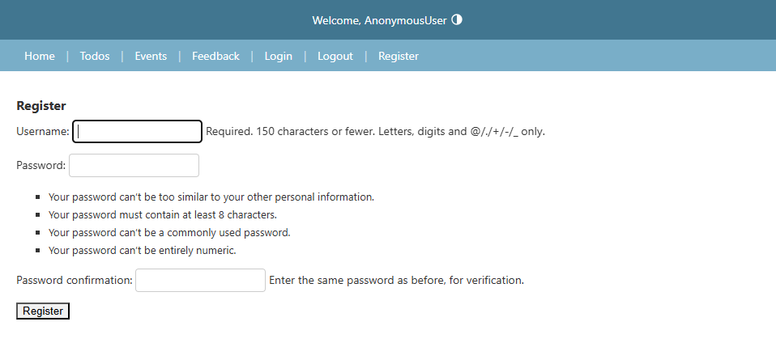
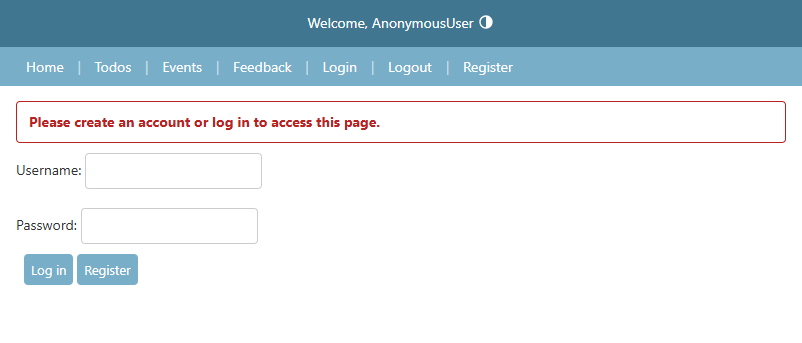
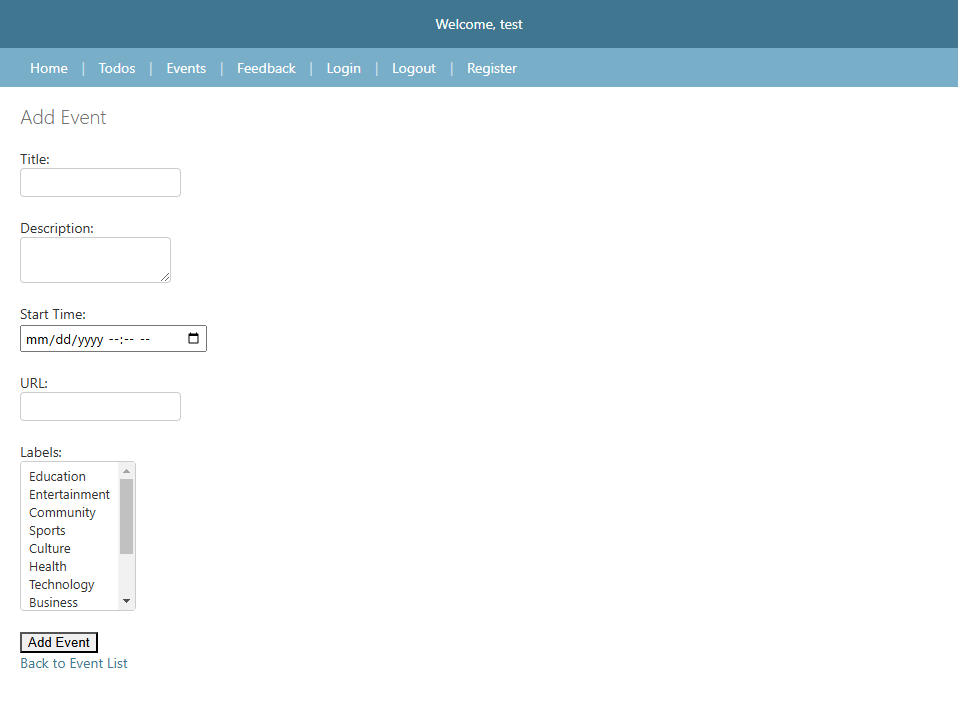
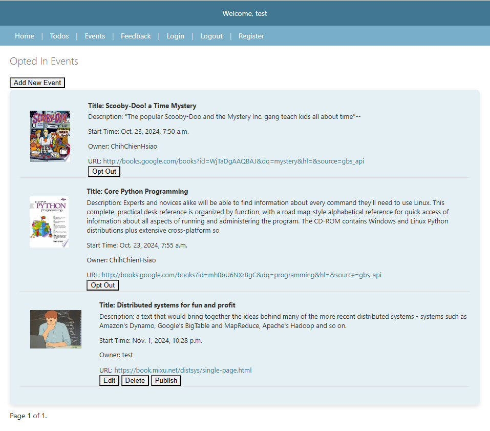
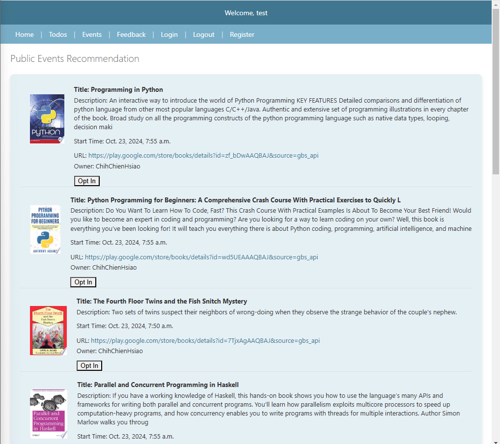

# My Django Learning Resource Management App

Welcome to the Django Learning Resource Management App! This application allows users to manage learning resources, including creating, updating, deleting, and viewing resource details. Below is a guide on how to interact with the app and its features.

## Features

- **User Authentication**: Sign up, log in, and log out .
- **Learning Resource Management**: Create, update, delete, and view resources.
- **Image Handling**: Display resource images, including YouTube thumbnails.
- **Pagination**: Navigate through multiple pages of resources.
- **Responsive Design**: Mobile-friendly interface.
- **Opt-In for Public Events**: Users can opt-in to public learning resources published by other users.
- **Recommendations for Opt-In Events**: Top recommendation learning resources are shown to users based on their opt-in events.

## Getting Started

### Prerequisites

- Python 3.x
- Django 3.x or later
- A web browser

### Installation

1. **Clone the repository**:
   ```bash
   git clone https://github.com/yourusername/your-repo.git
   cd your-repo
   ```

2. **Install dependencies**:
   ```bash
   pip install -r requirements.txt
   ```

3. **Run migrations**:
   ```bash
   python manage.py migrate
   ```

4. **Start the server**:
   ```bash
   python manage.py runserver
   ```

5. **Access the app**:
   Open your web browser and go to `http://127.0.0.1:8000/`.


## Usage

### User Authentication

- **Sign Up**: Create a new account by clicking on the "Sign Up" button on the homepage.
  

- **Log In**: Access your account by entering your credentials.
  

### Learning Resource Management

- **Create Resource**: Click on "Add New Resource" to create a new learning resource. Fill in the details and submit.
  

- **View Resources**: Browse through the list of resources. Click on a resource to view more details.
  

- **Edit Resource**: If you are the owner, click "Edit" to modify resource details.
  

- **Delete Resource**: Remove a resource by clicking "Delete".
  

- **Opt-In to Public Learning Resources Event**: Users can opt-in to public events that other users have published. Look for the public events section and click "Opt In" to participate.
- **Recommendations for Opt-In Events**: Top recommendation learning resources are shown to users based on their opt-in events.
  


## Contributing

Contributions are welcome! Please fork the repository and submit a pull request.

## License

This project is licensed under the GPL-3.0 License - see the [LICENSE](LICENSE) file for details.

## Contact

For questions or support, please contact [daniel13520cs@gmail.com](mailto:your-email@example.com).
