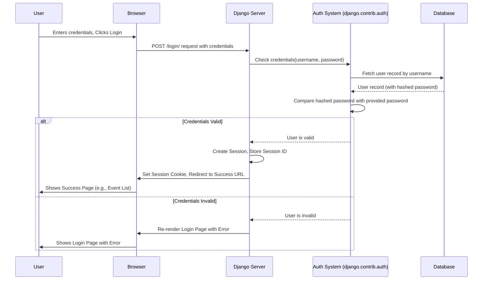

# Chapter 1: User Authentication (Django)

Welcome to the ResourceLearningWeb project tutorial! This is the very first chapter, and we're starting with something fundamental to many web applications: **User Accounts**.

Imagine our `ResourceLearningWeb` is like a digital library for learning events. Just like a real library, we need a way to know who's visiting and what they're allowed to do. Can anyone just walk in and add books to the shelves? Probably not! You usually need a library card (membership) first.

That's exactly what **User Authentication** is all about. It's our project's way of managing user accounts:

*   **Registration:** Getting a new "library card" (creating an account).
*   **Login:** Showing your "library card" to prove it's you.
*   **Logout:** Ending your session at the "library".

In `ResourceLearningWeb`, we want users to be able to add their *own* learning events or save events they find interesting. To do this securely and keep track of who owns what, users need to be logged in. This process of verifying a user's identity is called *authentication*.

## Why Do We Need This? The Use Case

Let's say you discover a fantastic online workshop about Python programming. You want to add it to `ResourceLearningWeb` so you can remember it and maybe others can see it too (if you make it public later).

But wait! How does the system know *you* are the one adding it? How can it make sure only *you* can edit or delete *your* event later?

This is where user authentication comes in. Before you can add the event, the system needs you to **log in**. If you don't have an account, you'll need to **register** first.

## Django's Built-in Helper: `django.contrib.auth`

Building a secure system for handling passwords, logins, and user permissions from scratch is *really* hard and tricky. Luckily, Django (the web framework we're using) comes with a built-in application called `django.contrib.auth`. Think of it as a pre-built, secure "membership management" toolkit.

This toolkit handles:
*   Storing user information (like usernames and *securely* hashed passwords).
*   Providing forms for login and registration.
*   Tools to check if a user is logged in.
*   Managing user permissions (though we'll keep it simple for now).

## Setting Up User Accounts in Our Project

Let's see how `ResourceLearningWeb` uses Django's authentication system.

### 1. Registration: Getting Your "Library Card"

First, a new user needs to sign up. We have a registration page for this.

**Code Reference (`playground/playground/urls.py`):**
This line tells Django that when someone visits the `/register/` URL, it should use the `register` function from our views.

```python
# playground/playground/urls.py
from django.urls import path
from .views import register # Import the register view

urlpatterns = [
    # ... other urls
    path('register/', register, name='register'), # Registration URL
    # ... other urls
]
```

**Code Reference (`playground/playground/views.py`):**
This `register` function uses a standard Django form (`UserCreationForm`) to handle the sign-up process. If the form details are valid, it saves the new user and automatically logs them in.

```python
# playground/playground/views.py
from django.shortcuts import render, redirect
from django.contrib.auth.forms import UserCreationForm
from django.contrib.auth import login

def register(request):
    if request.method == 'POST':
        form = UserCreationForm(request.POST)
        if form.is_valid():
            user = form.save() # Creates the new user in the database
            login(request, user) # Logs the new user in immediately
            return redirect('login') # Redirects to the login page (or maybe dashboard later)
    else:
        form = UserCreationForm() # Shows a blank registration form
    # Renders the registration page template with the form
    return render(request, 'registration/register.html', {'form': form})
```
*   **Input:** User enters username, password, password confirmation on the `/register/` page.
*   **Output:** A new user account is created, the user is logged in, and they are redirected (in this case, back to the login page, though often you'd go to a dashboard).

### 2. Login: Showing Your "Card"

Once registered, users can log in.

**Code Reference (`playground/playground/urls.py`):**
This line maps the `/login/` URL to Django's built-in `LoginView`, which we customize slightly.

```python
# playground/playground/urls.py
from django.urls import path
from .views import LoginView # Import our customized LoginView

urlpatterns = [
    # ... other urls
    path('login/', LoginView.as_view(), name='login'), # Login URL
    # ... other urls
]
```

**Code Reference (`playground/playground/views.py`):**
We create a `LoginView` that specifies which HTML template to use (`registration/login.html`) and where to redirect after a successful login (`list_publicEvents` page).

```python
# playground/playground/views.py
from django.contrib.auth.views import LoginView
from django.urls import reverse_lazy

class LoginView(LoginView):
    # Specify the template for login
    template_name = 'registration/login.html'

    # Where to go after successful login
    success_url = reverse_lazy('list_publicEvents')

    # (Optional) We could add more custom logic here if needed
```
*   **Input:** User enters their username and password on the `/login/` page.
*   **Output:** If credentials are correct, Django logs the user in, sets a special cookie in their browser to remember them, and redirects them to the `list_publicEvents` page. If incorrect, the login page shows an error.

### 3. Logout: Ending Your Session

Finally, users need a way to log out.

**Code Reference (`playground/playground/urls.py`):**
Maps the `/logout/` URL to our customized `LogoutView`.

```python
# playground/playground/urls.py
from django.urls import path
from .views import LogoutView # Import our customized LogoutView

urlpatterns = [
    # ... other urls
    path('logout/', LogoutView.as_view(), name='logout'), # Logout URL
    # ... other urls
]
```

**Code Reference (`playground/playground/views.py`):**
This view logs the user out and shows a confirmation page (`registration/logout.html`).

```python
# playground/playground/views.py
from django.contrib.auth.views import LogoutView
from django.urls import reverse_lazy

class LogoutView(LogoutView):
    template_name = 'registration/logout.html' # Show this page after logout
    next_page = reverse_lazy('logout') # Redirect back to the logout page itself (or could be homepage)
```
*   **Input:** User clicks the "Logout" link/button.
*   **Output:** Django logs the user out (invalidates their session cookie) and displays the logout confirmation page.

### 4. Protecting Actions: The `@login_required` Gatekeeper

Now, how do we ensure only logged-in users can add events? Django provides a neat tool called a **decorator**: `@login_required`.

Think of a decorator as a little note you stick onto a function definition. `@login_required` tells Django: "Hey, before running this function, make sure the user is logged in. If not, send them to the login page!"

**Code Reference (`playground/event/views.py`):**
Look at the `add_event` function. See that `@login_required` line just above `def add_event(...)`? That's the magic!

```python
# playground/event/views.py
from django.shortcuts import render, redirect
from django.contrib.auth.decorators import login_required # Import the decorator

# Function to add a new event
@login_required # <- THIS is the gatekeeper!
def add_event(request):
    if request.method == 'POST':
        # ... (code to get form data and save the event) ...
        # ... (associates event with request.user.id) ...
        event.ownerUserID = request.user.id # <-- Use the logged-in user's ID
        event.save()
        # ... (code to create UserEvents entry) ...
        return redirect('list_events')
    return render(request, 'events/add_event.html')
```
*   **If logged in:** The user can access the "Add Event" page, fill the form, and the `add_event` function runs normally. Notice how it uses `request.user.id` to link the event to the logged-in user.
*   **If NOT logged in:** If a user tries to go directly to the `/add_event/` URL, Django's authentication system intercepts them and automatically redirects them to the login page (defined by `LOGIN_URL` in `settings.py`).

Many other views in `event/views.py` also use `@login_required` (like `list_events`, `delete_event`, `update_event`, `optIn_publicEvents`, etc.) because these actions relate to a specific user's data or choices.

## Under the Hood: How Login Works (Simplified)

Let's quickly peek behind the curtain. What happens when you click "Login"?

1.  **You:** Enter username/password in your browser and click "Login".
2.  **Browser:** Sends these details securely to our Django server.
3.  **Django (URL Router):** Sees the `/login/` URL and directs the request to our `LoginView`.
4.  **Django (`LoginView`):** Uses the `django.contrib.auth` system to:
    *   Check if the username exists.
    *   Securely compare the provided password against the *hashed* password stored in the database (it never stores plain passwords!).
5.  **Django (`LoginView`):**
    *   **If Match:** Creates a "session" for you on the server and sends a special session ID cookie back to your browser. Your browser will send this cookie with every future request, proving you're logged in. It then redirects you to `success_url`.
    *   **If No Match:** Re-displays the login form with an error message.

Here's a diagram showing the flow:



Key pieces in our project settings (`playground/playground/settings.py`) that enable this:

*   `'django.contrib.auth'` and `'django.contrib.sessions'` listed in `INSTALLED_APPS`.
*   `'django.contrib.sessions.middleware.SessionMiddleware'` and `'django.contrib.auth.middleware.AuthenticationMiddleware'` in `MIDDLEWARE`. These components work together to manage the login sessions using cookies.
*   `LOGIN_URL = 'login'`: Tells `@login_required` where to redirect users who aren't logged in.

```python
# playground/playground/settings.py

INSTALLED_APPS = [
    # ... other apps
    'django.contrib.auth',      # The authentication framework
    'django.contrib.contenttypes',
    'django.contrib.sessions',  # The session framework
    # ... other apps
]

MIDDLEWARE = [
    # ... other middleware
    'django.contrib.sessions.middleware.SessionMiddleware', # Manages sessions across requests
    'django.middleware.common.CommonMiddleware',
    'django.middleware.csrf.CsrfViewMiddleware',
    'django.contrib.auth.middleware.AuthenticationMiddleware', # Associates users with requests using sessions
    'django.contrib.messages.middleware.MessageMiddleware',
    # ... other middleware
]

LOGIN_URL = 'login'  # URL name to redirect to for login if @login_required fails
```

## Conclusion

We've seen how essential user authentication is for `ResourceLearningWeb`. It acts like a membership system, allowing users to register, log in, and perform actions like adding or managing their own events. We learned that Django provides a powerful and secure built-in authentication system (`django.contrib.auth`) that handles the complexities for us. We also saw how the `@login_required` decorator easily protects specific parts of our application, ensuring only logged-in users can access them.

Now that we understand how users are managed, we need to define what an "event" actually *is* within our system. What information does an event contain (title, description, date, etc.)? How do we store this information? That's precisely what we'll cover in the next chapter.

Next up: [Event Data Model (MongoEngine)](02_event_data_model__mongoengine__.md)

---

Generated by [AI Codebase Knowledge Builder](https://github.com/The-Pocket/Tutorial-Codebase-Knowledge)