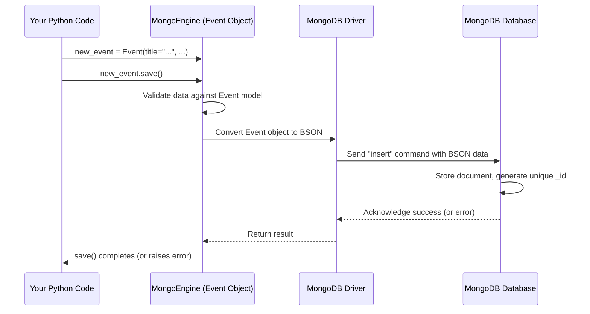

# Chapter 2: Event Data Model (MongoEngine)

Welcome back! In the [previous chapter](01_user_authentication__django__.md), we learned how our `ResourceLearningWeb` project manages users – how they register, log in, and how we make sure only logged-in users can perform certain actions. Think of it like getting your library card.

Now that we have members (users), we need to think about the *items* in our library: the learning resources. If someone wants to add a new online workshop or a cool tutorial they found, how do we store the information about it? We need a consistent way to record its title, where to find it (URL), maybe a short description, and who added it.

This chapter is all about defining the structure for these learning resources, which we call `Event`s in our code.

## What's the Problem? Organizing Event Information

Imagine you want to add a new learning event to our website – say, an online seminar about "Introduction to Python". You'd need to provide:

*   The **title**: "Introduction to Python Seminar"
*   A **description**: "A beginner-friendly seminar covering Python basics."
*   The **URL**: `https://example.com/python-seminar`
*   Maybe a **start time**: When the seminar happens.
*   And importantly, **who added it**: We need to link it back to your user account (from Chapter 1).

If another user adds a different event, like a "Data Science Workshop", they'd provide similar *types* of information (title, description, URL, etc.). We need a blueprint or a template that specifies *exactly* what pieces of information are required or allowed for *every* event added to our system. This blueprint is called a **Data Model**.

## Key Concepts: Model, Database, and Translator

Let's break down the tools we use to create this blueprint and store the information.

### 1. The Data Model (`Event`): Our Filing Card Template

The `Event` data model is like a detailed filing card template. It defines all the fields (pieces of information) that *every* learning resource (Event) in our system must have or can have.

**Code Reference (`event/models.py`):**
Here's a simplified look at how we define the `Event` template using Python code.

```python
# event/models.py
from mongoengine import Document, StringField, DateTimeField, URLField, IntField, BooleanField, ListField
from datetime import datetime

# This class defines the 'template' for an Event
class Event(Document):
    # Field for the event title (text, required, max 100 chars)
    title = StringField(required=True, max_length=100)
    # Field for the description (text, required, max 400 chars)
    description = StringField(required=True, max_length=400)
    # Field for the start time (date/time, required)
    startTime = DateTimeField(required=True, default=datetime.utcnow)
    # Field for the website link (URL, optional)
    URL = URLField(blank=True, null=True)
    # Field to store the ID of the user who owns this (number, required)
    ownerUserID = IntField(required=True)
    # Field to know if it's visible to everyone (True/False, default is False)
    isPublic = BooleanField(default=False)
    # Field for an image link (URL, optional)
    image = StringField(blank=True, null=True)
    # Field for tags/keywords (list of text strings, optional)
    tags = ListField(StringField(), default=[])
    # Field for labels (e.g., categories from crawler)
    labels = ListField(StringField(), default=[])

    # How the event should be represented as text (useful for debugging)
    def __str__(self):
        return self.title
```

*   **`class Event(Document):`**: This line declares we're creating a template named `Event`. It inherits features from `Document`, which is part of MongoEngine.
*   **`title = StringField(...)`**: This defines a field named `title` that must contain text (`StringField`). `required=True` means every event *must* have a title. `max_length=100` limits its length.
*   **Other Fields**: Similarly, we define fields for `description`, `startTime`, `URL`, `ownerUserID` (linking back to the user ID from Django's authentication system), `isPublic`, `image`, `tags`, and `labels`. Each field has a specific type (Text, Date, URL, Number, True/False, List of text).

This class *is* our data model. It doesn't hold any actual event data yet; it just defines the structure.

### 2. The Database (MongoDB): Our Digital Filing Cabinet

Okay, we have a template (the `Event` model). Where do we store the actual "filing cards" filled with information about specific events? We use a database called **MongoDB**.

Think of MongoDB not like a spreadsheet with rigid rows and columns (like traditional SQL databases), but more like a **digital filing cabinet** designed to hold flexible documents. Each "document" can store information in a format similar to JSON (key-value pairs), which maps nicely to our Python `Event` object. MongoDB is great when your data structure might evolve or when you have data that doesn't fit neatly into tables.

### 3. The Translator (MongoEngine): Connecting Python and MongoDB

How does our Python code (like the `Event` class) talk to the MongoDB filing cabinet? We use a library called **MongoEngine**.

MongoEngine acts as a **translator**. It allows us to:
*   Define our data models (like the `Event` class) using Python code, which is often easier to work with.
*   Take Python objects (like an instance of our `Event` class filled with data) and automatically translate them into the format MongoDB understands.
*   Save these objects into the MongoDB database.
*   Retrieve documents from MongoDB and translate them back into Python `Event` objects that our code can use.

## Using the `Event` Model: Creating a New Event

Let's see how this works when a user adds a new event. Remember the `add_event` function from Chapter 1? It uses our `Event` model.

**Simplified Example Code:**

```python
# (Inside a function like add_event, after getting user input)
from event.models import Event # Import our Event template
from datetime import datetime

# 1. Get data (e.g., from a web form)
event_title = "Introduction to Python Seminar"
event_desc = "A beginner-friendly seminar."
event_url = "https://example.com/python-seminar"
event_start = datetime.now() # Use current time as example
current_user_id = 1 # Assume the logged-in user has ID 1

# 2. Create an 'Event' object using our template
new_event = Event(
    title=event_title,
    description=event_desc,
    startTime=event_start,
    URL=event_url,
    ownerUserID=current_user_id,
    isPublic=False # Default to private
)

# 3. Save the object to the database via MongoEngine
try:
    new_event.save()
    print("Event saved successfully!")
except Exception as e:
    print(f"Error saving event: {e}")

```

*   **Input:** We gather the information for the new event (title, description, URL, start time, owner's ID).
*   **Process:**
    *   We create an instance of our `Event` class, filling in the fields defined in the model. `new_event` is now a Python object holding this data.
    *   We call the `.save()` method on this object. This is where MongoEngine steps in.
*   **Output:** MongoEngine translates the `new_event` Python object into a MongoDB document and stores it in the database. If successful, the message "Event saved successfully!" is printed. If there's an error (like a required field missing), an error message is printed.

## Under the Hood: How `.save()` Works

What happens when `new_event.save()` is called?

1.  **Python Object:** You have your `new_event` object in Python memory, filled with data.
2.  **MongoEngine:** The `.save()` method tells MongoEngine to prepare this object for storage.
3.  **Translation:** MongoEngine converts the Python object's fields and values into a BSON format (a binary version of JSON) that MongoDB understands.
4.  **MongoDB Driver:** MongoEngine uses the underlying MongoDB driver (another piece of software) to actually send the command and the BSON data to the MongoDB database server.
5.  **MongoDB:** The database server receives the data and stores it as a new document within a collection (think of a collection like a folder for specific types of documents, e.g., an 'events' collection). MongoDB automatically assigns a unique ID (`_id`) to this new document.

Here's a diagram illustrating the flow:



**Connecting to the Database:**

Before any of this can happen, our application needs to know *how* to connect to the MongoDB database (its address, username, password, etc.). This connection is typically set up when the application starts.

**Code Reference (`MLAlgo/webCrawler/crawler.py` - Connection Example):**
This snippet shows how the connection might be established using MongoEngine's `connect` function. (Note: In a real Django app, this might be configured differently, often in `settings.py` or an initialization file).

```python
# MLAlgo/webCrawler/crawler.py (Simplified Connection Logic)
from mongoengine import connect
import urllib.parse

# --- Database Credentials (Keep these secure!) ---
username = 'your_mongo_username'
password = 'your_mongo_password'
db_host = 'your_mongodb_cluster_address' # e.g., playground.lskld.mongodb.net
db_name = 'Playground' # The name of the database to use
# --- End Credentials ---

# Prepare username/password for the connection string
escaped_username = urllib.parse.quote_plus(username)
escaped_password = urllib.parse.quote_plus(password)
# Construct the connection string
connection_uri = f"mongodb+srv://{escaped_username}:{escaped_password}@{db_host}/{db_name}?retryWrites=true&w=majority"

# Establish the connection
try:
    connect(host=connection_uri) # Tell MongoEngine where the DB is
    print("MongoDB connected successfully!")
except Exception as e:
    print(f"Error connecting to MongoDB: {e}")

```

*   This code builds a special connection string (`connection_uri`) containing the credentials and address of the MongoDB server.
*   The `connect(host=connection_uri)` function tells MongoEngine to establish a connection to that database. Once this runs successfully, other parts of the code (like `Event.save()`) can interact with the database.

**The `Event` Model in `event/models.py` again:**

```python
# event/models.py
from mongoengine import Document, StringField, DateTimeField, #... other fields
# ... other imports

# This class definition tells MongoEngine how to structure 'Event' documents in MongoDB
class Event(Document):
    title = StringField(required=True, max_length=100)
    description = StringField(required=True, max_length=400)
    startTime = DateTimeField(required=True, default=datetime.utcnow)
    # ... other fields defined earlier ...

    # MongoEngine uses this definition to know what fields
    # exist when saving/loading data from the 'event' collection
    # in MongoDB.
```

This class is the central piece. MongoEngine uses it as the blueprint when communicating with MongoDB for anything related to Events.

## Conclusion

We've now defined the heart of our learning resources: the **`Event` Data Model**. We learned:

*   A **Data Model** acts like a template or blueprint (`Event` class) defining the structure of our data.
*   We use **MongoDB** as our flexible "digital filing cabinet" to store the actual event information.
*   **MongoEngine** acts as the translator, letting us define the model in Python and easily save/load Python `Event` objects to/from MongoDB.
*   The `Event` model specifies fields like `title`, `description`, `URL`, `startTime`, and importantly `ownerUserID` to link it back to a user.

With a way to manage users ([Chapter 1](01_user_authentication__django__.md)) and a structure to store event details (this chapter), we can now explore how these events are shared and how users interact with them. How do we make some events public for everyone to see? How can users "opt-in" to events they find interesting?

Next up: [Public Events & Opt-In System](03_public_events___opt_in_system_.md)

---

Generated by [AI Codebase Knowledge Builder](https://github.com/The-Pocket/Tutorial-Codebase-Knowledge)