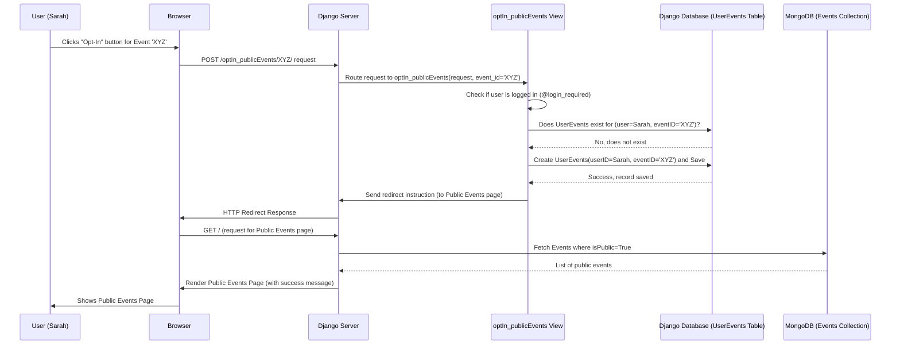

# Chapter 3: Public Events & Opt-In System

Welcome back! In the [previous chapter](02_event_data_model__mongoengine__.md), we designed our digital "filing card" – the `Event` data model using MongoEngine. This template allows us to store details like the title, description, and URL for any learning resource a user adds.

But right now, when a user adds an event, it's like they're putting that filing card into their *private* shoebox. Only they can see it. What if they found a really great public webinar and want to share it with everyone else using `ResourceLearningWeb`? And what if other users want to "bookmark" the public events they find interesting so they can easily find them later?

This chapter is all about **sharing** and **tracking** events. We'll explore:

1.  How to mark an `Event` as "public" so everyone can see it.
2.  How logged-in users can "opt-in" (like adding a bookmark) to public events they care about.

## The Use Case: Sharing and Bookmarking Events

Imagine you've just added details about an upcoming free online workshop on "Creative Writing Basics" using the form we discussed in the previous chapter. By default, it's only visible to you.

*   **Sharing:** You think this workshop is fantastic and want *everyone* visiting the site to see it. You need a way to make it "public".
*   **Bookmarking:** Another user, let's call her Sarah, browses the site and sees your public "Creative Writing Basics" event. She's interested! She wants a way to save it to her own list of interesting events without having to search for it every time. She needs to "opt-in".

This "Public Events & Opt-In System" makes both of these actions possible.

## Key Concepts: Flags and Bookmarks

Let's break down how we achieve this.

### 1. The `isPublic` Flag: Public vs. Private Filing Cards

Remember our `Event` model from [Chapter 2](02_event_data_model__mongoengine__.md)? We included a special field:

**Code Reference (`event/models.py` - `Event` model):**

```python
# event/models.py (inside the Event class)
class Event(Document):
    # ... other fields like title, description ...
    ownerUserID = IntField(required=True)
    # THIS is the important flag for this chapter!
    isPublic = BooleanField(default=False) # True/False field
    # ... other fields like tags, image ...
```

*   **`isPublic = BooleanField(default=False)`**: This line adds a field called `isPublic` to our `Event` template.
    *   `BooleanField` means it can only hold one of two values: `True` or `False`.
    *   `default=False` means that whenever a *new* event is created, this flag is automatically set to `False` (private) unless we specifically change it.

Think of this `isPublic` flag like a little checkbox on our filing card analogy.
*   **`isPublic = False` (Default):** The card is kept in the owner's private shoebox.
*   **`isPublic = True`:** The card is marked as 'public' and placed in a public display case where anyone can see it.

### 2. Opting In: Adding a Bookmark

Okay, so we can make events public. Now, how does Sarah "bookmark" the public "Creative Writing Basics" event? We need a way to record that *Sarah* is interested in *that specific event*.

We can't just store this information on the `Event` card itself, because many different users might want to bookmark the same event. Instead, we need a separate "logbook" or list that tracks these connections.

### 3. The `UserEvents` Model: The Bookmark Logbook

To keep track of which user has bookmarked (opted-in to) which event, we introduce another model. This one, however, lives in the Django world, because it directly links a Django `User` (from [Chapter 1](01_user_authentication__django__.md)) to an `Event` (identified by its unique ID from MongoDB).

**Code Reference (`event/models.py` - `UserEvents` model):**

```python
# event/models.py
from django.db import models # Import Django's models
from django.contrib.auth.models import User # Import Django's User model

# This model stores the link between a User and an Event they opted into
class UserEvents(models.Model):
    # Link to the standard Django User table. If User is deleted, this entry is also deleted.
    userID = models.ForeignKey(User, on_delete=models.CASCADE)
    # Store the unique ID of the Event from MongoDB (as text)
    eventID = models.CharField(max_length=24)

    def __str__(self):
        return f'userID: {self.userID} - Event ID: {self.eventID}'
```

*   **`class UserEvents(models.Model):`**: We define a standard Django model called `UserEvents`.
*   **`userID = models.ForeignKey(User, ...)`**: This creates a link to a specific user in Django's built-in `User` table. It's like writing down the library card number of the user who made the bookmark.
*   **`eventID = models.CharField(max_length=24)`**: This field stores the unique ID (`_id`) of the `Event` document from our MongoDB database. Since MongoDB IDs are usually represented as strings (like `65a8f3b9c4a5b6d7e8f9a0b1`), we use a `CharField` (a text field) to store it. This is like writing down the unique serial number of the public filing card being bookmarked.

So, every time Sarah opts-in to an event, we create a *new row* in the `UserEvents` table (logbook) containing *her* `userID` and the `eventID` of the event she bookmarked.

## How It Works: Seeing the System in Action

Let's follow the journey of our "Creative Writing Basics" event.

### 1. Making the Event Public (`publish_event`)

You, the owner of the event, decide to share it. You might click a "Publish" button next to your event in your private list. This triggers a request to our server.

**Code Reference (`event/urls.py`):**
This line connects the URL `/publish/EVENT_ID/` to the `publish_event` function.

```python
# event/urls.py
path('publish/<str:event_id>/', publish_event, name='publish_event'),
```

**Code Reference (`event/views.py` - Simplified `publish_event`):**
This function finds the event and flips its `isPublic` flag to `True`.

```python
# event/views.py
from django.shortcuts import redirect, get_object_or_404
from .models import Event # Import the Event model
from django.contrib.auth.decorators import login_required
from django.contrib import messages

@login_required # User must be logged in
def publish_event(request, event_id):
    # Find the Event in MongoDB using its ID
    event = get_object_or_404(Event, id=event_id)

    # IMPORTANT: Check if the current user actually owns this event!
    if request.user.id != event.ownerUserID:
        messages.error(request, "You can only publish your own events.")
        return redirect('list_events') # Redirect back to their private list

    # Only proceed if the user owns the event
    if request.method == 'POST': # Usually triggered by a button click
        if not event.isPublic:
            event.isPublic = True # Set the flag to True
            event.save()          # Save the change back to MongoDB
            messages.success(request, 'Event published successfully!')
        else:
            messages.info(request, 'Event was already public.')

    return redirect('list_events') # Go back to the user's event list
```

*   **Input:** User clicks "Publish" on an event they own (identified by `event_id`).
*   **Process:**
    *   The code finds the `Event` in MongoDB.
    *   It checks if the logged-in user is the owner.
    *   It sets the `isPublic` field of that `Event` object to `True`.
    *   It calls `event.save()` which tells MongoEngine to update the event document in the database.
*   **Output:** The event is now marked as public in the database. The user is redirected back to their event list with a success message.

### 2. Viewing Public Events (`list_publicEvents`)

Now Sarah visits the public events page. The website needs to show *only* the events marked with `isPublic = True`.

**Code Reference (`event/urls.py`):**
The root URL `/` (or maybe `/events/public/`) is mapped to `list_publicEvents`.

```python
# event/urls.py
# The first path maps the base URL for events to list_publicEvents
path('', list_publicEvents, name='list_publicEvents'),
```

**Code Reference (`event/views.py` - Simplified `list_publicEvents`):**
This function queries MongoDB for all events where `isPublic` is `True`.

```python
# event/views.py
from django.shortcuts import render
from .models import Event # Import the Event model
# (Other imports like Paginator might be here too)

def list_publicEvents(request):
    # Query MongoDB via MongoEngine:
    # Find all Event documents where the 'isPublic' field is True
    publicEvents = Event.objects.filter(isPublic=True)

    # (Code here would typically handle pagination and adding owner usernames)
    # ...

    # Pass the list of public events to the HTML template
    context = {'events': publicEvents}
    return render(request, 'events/list_public_events.html', context)
```

*   **Input:** Sarah visits the public events page.
*   **Process:**
    *   `Event.objects.filter(isPublic=True)` tells MongoEngine to ask MongoDB for all `Event` documents that have the `isPublic` field set to `True`.
*   **Output:** A list of public `Event` objects is retrieved and sent to the `list_public_events.html` template, which displays them to Sarah. She now sees the "Creative Writing Basics" workshop!

### 3. Opting In (`optIn_publicEvents`)

Sarah sees the "Creative Writing Basics" event and clicks an "Opt-In" or "Bookmark" button next to it.

**Code Reference (`event/urls.py`):**
Connects the URL `/optIn_publicEvents/EVENT_ID/` to the `optIn_publicEvents` function.

```python
# event/urls.py
path('optIn_publicEvents/<str:event_id>/', optIn_publicEvents, name='optIn_publicEvents'),
```

**Code Reference (`event/views.py` - Simplified `optIn_publicEvents`):**
This function creates a new record in the `UserEvents` table to link Sarah to the event.

```python
# event/views.py
from django.shortcuts import redirect
from .models import Event, UserEvents # Import both models
from django.contrib.auth.decorators import login_required
from django.contrib import messages

@login_required # User must be logged in to opt-in
def optIn_publicEvents(request, event_id):
    if request.method == 'POST': # Usually triggered by a button click
        # Check if the user has ALREADY opted into this specific event
        already_opted_in = UserEvents.objects.filter(
            userID=request.user,
            eventID=str(event_id)
        ).exists() # .exists() is efficient, returns True or False

        if already_opted_in:
            messages.warning(request, 'You have already opted into this event.')
        else:
            # Create a new UserEvents entry (a new row in the logbook)
            new_opt_in = UserEvents(
                userID=request.user,      # The logged-in user (Sarah)
                eventID=str(event_id)     # The ID of the event she clicked on
            )
            new_opt_in.save() # Save the new entry to the UserEvents table (Django DB)
            messages.success(request, 'Successfully opted into the event!')

    # Redirect back to the list of public events
    return redirect('list_publicEvents')
```

*   **Input:** Sarah (logged in) clicks "Opt-In" for the event with ID `event_id`.
*   **Process:**
    *   The code checks if a `UserEvents` record *already exists* for this user and this event ID.
    *   If not, it creates a *new* `UserEvents` object, setting `userID` to Sarah's user object (`request.user`) and `eventID` to the ID of the chosen event.
    *   It calls `new_opt_in.save()` to store this new record in the Django database (the `UserEvents` table). This is the "bookmark" being saved.
*   **Output:** A new row is added to the `UserEvents` table. Sarah is redirected back to the public events list with a success message.

### 4. Opting Out (`optOut_publicEvents`)

Later, Sarah decides she's no longer interested in the "Creative Writing Basics" workshop listed on *her* bookmarked events page. She clicks an "Opt-Out" or "Remove Bookmark" button.

**Code Reference (`event/urls.py`):**
Connects the URL `/optOut_publicEvents/EVENT_ID/` to the `optOut_publicEvents` function.

```python
# event/urls.py
path('optOut_publicEvents/<str:event_id>/', optOut_publicEvents, name='optOut_publicEvents'),
```

**Code Reference (`event/views.py` - Simplified `optOut_publicEvents`):**
This function finds and deletes the specific `UserEvents` record linking Sarah to the event.

```python
# event/views.py
# (Imports are similar to optIn_publicEvents)

@login_required # User must be logged in
def optOut_publicEvents(request, event_id):
    if request.method == 'POST': # Usually triggered by button click
        try:
            # Find the specific UserEvents record linking this user to this event
            event_to_remove = UserEvents.objects.get(
                userID=request.user,
                eventID=str(event_id)
            )
            # If found, delete it from the UserEvents table
            event_to_remove.delete()
            messages.success(request, 'Successfully opted out of the event.')
        except UserEvents.DoesNotExist:
            # Handle case where they weren't opted in anyway
            messages.warning(request, 'You were not opted into this event.')

    # Redirect back to the user's list of *opted-in* events
    # (This often goes back to 'list_events', which shows opted-in events)
    return redirect('list_events')
```

*   **Input:** Sarah (logged in) clicks "Opt-Out" for an event with ID `event_id` on her list of opted-in events.
*   **Process:**
    *   The code tries to find the *single* `UserEvents` record where the `userID` matches Sarah's ID and the `eventID` matches the event she wants to remove.
    *   If found, it calls `.delete()` on that record, removing the row from the `UserEvents` table in the Django database. The "bookmark" is erased.
*   **Output:** The corresponding row is removed from the `UserEvents` table. Sarah is redirected back to her list of opted-in events (which no longer includes the removed event) with a success message.

## Under the Hood: The Opt-In Flow

Let's visualize the steps when Sarah clicks "Opt-In":



This diagram shows how clicking the button triggers a series of checks and actions involving both the Django application logic (checking login, interacting with the `UserEvents` table) and the database (storing the bookmark).

## Conclusion

In this chapter, we saw how `ResourceLearningWeb` handles the sharing and tracking of events:

*   We use the simple `isPublic` flag (a `BooleanField`) within our `Event` model ([Chapter 2](02_event_data_model__mongoengine__.md)) to distinguish between private and public events.
*   We introduced a separate Django model, `UserEvents`, to act as a "bookmark logbook". This model creates a link between a `User` ([Chapter 1](01_user_authentication__django__.md)) and an `Event`'s ID.
*   We looked at the views (`publish_event`, `list_publicEvents`, `optIn_publicEvents`, `optOut_publicEvents`) that allow users to publish their events, view public ones, and manage their own bookmarks (opt-ins/opt-outs).

This system allows events created by individual users to be shared with the community, and for community members to easily track the events they find most relevant.

Now that we understand how users can own events and also opt-in to others' public events, let's take a slightly closer look at these connections. How exactly is the `ownerUserID` stored? How does the `list_events` view (which shows events a user owns *or* has opted into) work?

Next up: [User-Event Relationship](04_user_event_relationship_.md)

---

Generated by [AI Codebase Knowledge Builder](https://github.com/The-Pocket/Tutorial-Codebase-Knowledge)