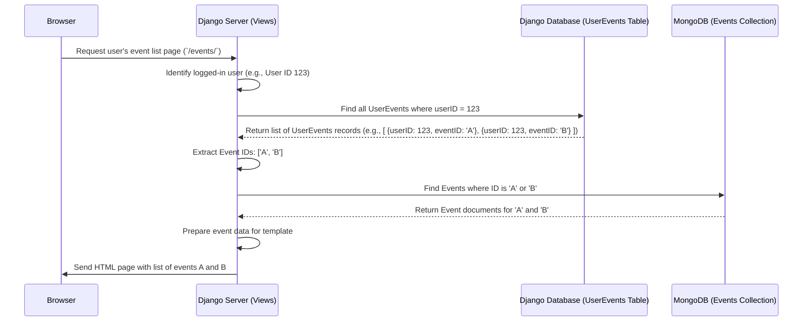

# Chapter 4: User-Event Relationship

Welcome back! In [Chapter 3: Public Events & Opt-In System](03_public_events___opt_in_system_.md), we saw how events can be made public and how users can "opt-in" or "bookmark" events they find interesting using a Django model called `UserEvents`.

Now, let's zoom in on how our project manages the *connection* between users and events. It might seem simple, but remember, our users are stored in one place (Django's standard user system, like a library membership list) and our event details are stored somewhere completely different (MongoDB, like a separate set of filing cabinets for event descriptions). How do we reliably link a specific library member to a specific filing card?

This chapter focuses on this crucial link – the **User-Event Relationship**.

## The Problem: Connecting Two Different Worlds

Imagine our librarian needs to keep track of two things for every user:
1.  Which event "filing cards" did this user originally create and own?
2.  Which *public* event "filing cards" (maybe created by someone else) has this user bookmarked because they're interested?

Since the user list (Django Users) and the event filing cards (MongoDB Events) are in separate systems, we need a clear way to manage these connections. We can't just draw arrows between the systems directly!

## Key Concepts: Ownership vs. Bookmarks

There are two main ways a user is connected to an event in `ResourceLearningWeb`:

### 1. Event Ownership (`ownerUserID` field in MongoDB)

When a user creates a *new* event, we need to remember who the original creator is. This is important for things like allowing only the owner to edit or delete their event.

We store this information *directly on the event "filing card"* itself in MongoDB. Remember the `Event` model from [Chapter 2: Event Data Model (MongoEngine)](02_event_data_model__mongoengine__.md)? It has a specific field for this:

**Code Reference (`event/models.py` - `Event` model snippet):**

```python
# event/models.py (inside the Event class in MongoDB)
class Event(Document):
    # ... other fields like title, description ...
    # THIS field stores the ID of the user who created the event
    ownerUserID = IntField(required=True)
    # ... other fields like isPublic ...
```

*   **`ownerUserID = IntField(required=True)`**: This field within the MongoDB `Event` document stores the unique ID number of the Django user who created the event. It's like writing the owner's library card number directly onto the filing card.

### 2. Event Opt-In/Bookmark (`UserEvents` model in Django)

As we saw in Chapter 3, when a user wants to "bookmark" or "opt-in" to a public event (whether they created it or someone else did), we need to record that specific connection. We can't store a list of *all* interested users on the MongoDB event card – that could get very long and inefficient!

Instead, we use our "librarian's logbook" – the `UserEvents` model. This model lives in the *Django* database (alongside the User accounts).

**Code Reference (`event/models.py` - `UserEvents` model snippet):**

```python
# event/models.py (Django model)
from django.db import models
from django.contrib.auth.models import User

class UserEvents(models.Model):
    # Link to the Django User who opted-in
    userID = models.ForeignKey(User, on_delete=models.CASCADE)
    # The unique ID (as text) of the Event in MongoDB
    eventID = models.CharField(max_length=24)

    # ... __str__ method ...
```

*   **`userID = models.ForeignKey(User, ...)`**: Links to the specific user in Django's `User` table (the library member).
*   **`eventID = models.CharField(max_length=24)`**: Stores the unique ID of the `Event` from MongoDB (the filing card's serial number).

Every time a user opts-in, a *new row* is added to this `UserEvents` table in the Django database, creating a specific link: "This User is interested in that Event".

## How It Works: Seeing the Links in Action

Let's see how the system uses these two types of links.

### Finding Events a User Owns

If we needed to find *only* the events a specific user created, we would query the MongoDB `Event` collection and filter by the `ownerUserID` field.

**Conceptual Example (not exact code from project):**

```python
# How to conceptually find events owned by user with ID 5
user_id_to_find = 5
# Ask MongoDB for all Events where 'ownerUserID' matches 5
owned_events = Event.objects.filter(ownerUserID=user_id_to_find)
# 'owned_events' now holds the events created by user 5
```

*   **Input:** A user's ID (e.g., 5).
*   **Process:** Search the MongoDB `Event` documents for those where the `ownerUserID` field equals 5.
*   **Output:** A list of `Event` objects owned by that user.

### Finding Events a User Has Opted Into (Bookmarked)

This is what the `list_events` view actually does. It shows the user all the events they have bookmarked (which includes events they created, because the `add_event` view automatically creates a `UserEvents` entry for the owner).

**Code Reference (`event/views.py` - `list_events` snippet):**

```python
# event/views.py
from .models import UserEvents, Event # Import both models
from django.contrib.auth.decorators import login_required

@login_required
def list_events(request):
    # 1. Find all 'logbook' entries for the currently logged-in user
    user_opt_ins = UserEvents.objects.filter(userID=request.user)

    # 2. Get the unique IDs of the events from those entries
    event_ids = [opt_in.eventID for opt_in in user_opt_ins]

    # 3. Fetch the full details of those events from MongoDB
    events_details = Event.objects.filter(id__in=event_ids)

    # ... (code to prepare 'events_details' for the template) ...
    # return render(request, 'events/list_events.html', {'events': ...})
```

*   **Input:** The currently logged-in user (`request.user`).
*   **Process:**
    1.  Query the Django `UserEvents` table ("logbook") to find all rows matching the current user's ID.
    2.  Extract the `eventID` (MongoDB event IDs) from each of those rows.
    3.  Query the MongoDB `Event` collection to get the full details for only those specific event IDs.
*   **Output:** A list of `Event` objects that the user has opted into, ready to be displayed on their personal event list page.

Notice how this involves talking to *both* databases: first Django's database to find the *links*, then MongoDB to get the *event details*.

## Under the Hood: The Bridge in Action

The `UserEvents` model is the critical bridge. It doesn't store the event *details* (like title or description) – MongoDB does that. It doesn't store the full *user profile* – Django's `User` model does that. It only stores the *relationship*: **User X is linked to Event Y**.

Let's visualize the process for the `list_events` view:



This diagram shows the flow: the request comes in, Django checks its own database (`UserEvents`) first to see which events the user cares about, and then uses those IDs to fetch the actual event details from MongoDB.

### The Bridge Model (`UserEvents`)

Let's look at the definition again, which enables this bridging:

**Code Reference (`event/models.py` - `UserEvents` model):**

```python
# event/models.py
from django.db import models
from django.contrib.auth.models import User # Django's built-in User

# This model lives in the Django database
class UserEvents(models.Model):
    # A direct link to a row in Django's auth_user table.
    # If the User is deleted, these links are automatically removed.
    userID = models.ForeignKey(User, on_delete=models.CASCADE)

    # Stores the unique ID (_id) from a MongoDB Event document.
    # Stored as text because MongoDB IDs aren't simple numbers.
    eventID = models.CharField(max_length=24)

    def __str__(self):
        return f'userID: {self.userID} - Event ID: {self.eventID}'
```

This simple Django model is the key. It allows us to use Django's database system (which is good at managing relationships like `ForeignKey`) to keep track of connections to items stored in a completely different system (MongoDB).

## Conclusion

In this chapter, we explored the two ways users are linked to events in `ResourceLearningWeb`:

1.  **Ownership:** Tracked by the `ownerUserID` field directly within the `Event` document in MongoDB.
2.  **Opt-In (Bookmark):** Tracked by creating records in the `UserEvents` Django model, which acts as a logbook or bridge connecting a Django `User` to a MongoDB `Event` ID.

We saw how the `list_events` view cleverly uses the `UserEvents` bridge to first find out *which* events a user has bookmarked (by querying the Django database) and then fetches the details of those specific events (from the MongoDB database).

Understanding this relationship is crucial for managing user-specific views and actions. Now that we have a solid grasp of users, events, and the connections between them, we can look more closely at the Django views responsible for handling user interactions like adding, updating, deleting, and viewing events.

Next up: [Event Management Views (Django)](05_event_management_views__django__.md)

---

Generated by [AI Codebase Knowledge Builder](https://github.com/The-Pocket/Tutorial-Codebase-Knowledge)