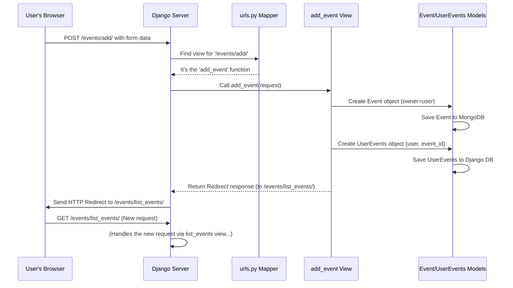

# Chapter 5: Event Management Views (Django)

Welcome back! In the [previous chapter](04_user_event_relationship_.md), we dug into how users are connected to events, either as owners (`ownerUserID` in the event itself) or through bookmarks (`UserEvents` model). We saw how these links bridge the gap between our Django user system and our MongoDB event storage.

Now, imagine you're using the `ResourceLearningWeb` website. You click buttons like "Add Event", "My Events", "Edit", "Delete", or "Opt-In". What happens behind the scenes when you click? How does the website know what action to perform and what page to show you next?

This chapter introduces **Django Views**, the workhorses that handle these user interactions for our `Event` resources.

## The Problem: Handling User Requests for Events

Think of our website like a library and the event data like filing cards in a cabinet. You, the user, are at the front desk (your web browser). You want to:

*   **Add a new card:** Fill out a form to add a new learning resource.
*   **See your checked-out cards:** View the list of events you own or have bookmarked.
*   **Update a card:** Correct some information on an event you own.
*   **Discard a card:** Delete an event you own or remove a bookmark.
*   **Bookmark a public card:** Opt-in to an event someone else shared.

Who handles these requests at the front desk? The librarians! In Django, these "librarians" are called **Views**.

**Views** are Python functions (or sometimes classes) that take your request (like clicking "Add Event"), do the necessary work (like preparing a blank form or saving data to the database), and then decide what response to send back to your browser (like showing you the form page, redirecting you to your event list, or displaying a success message).

## Key Concept: Django Views - The Request Handlers

A Django view function typically does the following:

1.  **Receives a Request:** Gets information about what the user wants to do (e.g., the URL they visited, data they submitted in a form). This comes in an object often named `request`.
2.  **Performs Actions:** Interacts with the data models ([Event Data Model (MongoEngine)](02_event_data_model__mongoengine__.md), [User-Event Relationship](04_user_event_relationship_.md)) to fetch, create, update, or delete data. It might also check permissions ([User Authentication (Django)](01_user_authentication__django__.md)).
3.  **Sends a Response:** Returns something back to the user's browser. This is often:
    *   An HTML page (rendered from a template).
    *   A redirect (telling the browser to go to a different URL).

## Connecting URLs to Views: The `urls.py` File

How does Django know *which* view function (librarian) should handle a request for a specific URL (like `/add/` or `/delete/some-event-id/`)? It uses a mapping file, typically called `urls.py`.

Think of `urls.py` as the library's directory – it tells you which desk (URL path) is handled by which librarian (view function).

**Code Reference (`event/urls.py` - Simplified):**

```python
# event/urls.py
from django.urls import path
# Import the view functions from views.py
from .views import add_event, list_events, delete_event, update_event, optIn_publicEvents, list_publicEvents

urlpatterns = [
    # When user visits the base event URL ('/events/'), call list_publicEvents
    path('', list_publicEvents, name='list_publicEvents'),
    # When user visits '/events/list_events', call list_events
    path('list_events', list_events, name='list_events'),
    # When user visits '/events/add/', call add_event
    path('add/', add_event, name='add_event'),
    # When user visits '/events/delete/EVENT_ID/', call delete_event
    # <str:event_id> captures the event ID from the URL
    path('delete/<str:event_id>/', delete_event, name='delete_event'),
    # When user visits '/events/update/EVENT_ID/', call update_event
    path('update/<str:event_id>/', update_event, name='update_event'),
    # When user visits '/events/optIn_publicEvents/EVENT_ID/', call optIn_publicEvents
    path('optIn_publicEvents/<str:event_id>/', optIn_publicEvents, name='optIn_publicEvents'),
    # ... other paths ...
]
```

*   Each `path(...)` entry links a URL pattern (like `add/` or `delete/<str:event_id>/`) to a specific view function (`add_event`, `delete_event`).
*   The `name='...'` part gives a convenient nickname to the URL, which we can use in templates or redirects.

Now, let's look at some of the key view functions ("librarians") in `event/views.py`.

## Example Views in Action

We'll look at simplified versions of the views defined in `playground/event/views.py`.

### 1. Adding a New Event (`add_event`)

This view handles both showing the "Add Event" form and processing the submitted data. Remember from [Chapter 1](01_user_authentication__django__.md), the `@login_required` decorator ensures only logged-in users can access this.

**Code Reference (`event/views.py` - Simplified `add_event`):**

```python
# event/views.py
from django.shortcuts import render, redirect
from .models import Event, UserEvents # Import our models
from django.contrib.auth.decorators import login_required
from datetime import datetime

@login_required # Only logged-in users!
def add_event(request):
    # Check if the user submitted the form (POST request)
    if request.method == 'POST':
        # 1. Get data from the submitted form
        title = request.POST.get('title')
        description = request.POST.get('description')
        # ... (get startTime, URL) ...

        # 2. Create a new Event object (using the model from Chapter 2)
        new_event = Event(
            title=title,
            description=description,
            # ... (set startTime, URL) ...
            ownerUserID=request.user.id # Link to the logged-in user
        )
        new_event.save() # Save the event to MongoDB

        # 3. Create the UserEvents link (from Chapter 4)
        # Automatically "opt-in" the owner to their own event
        user_event_link = UserEvents(
            userID=request.user,
            eventID=str(new_event.id) # Get the new event's MongoDB ID
        )
        user_event_link.save() # Save the link to Django DB

        # 4. Redirect the user to their list of events
        return redirect('list_events')
    else:
        # If it's not a POST request, just show the blank form (GET request)
        return render(request, 'events/add_event.html')
```

*   **Input (GET):** User navigates to `/events/add/`.
*   **Output (GET):** The `add_event.html` template is displayed, showing a blank form.
*   **Input (POST):** User fills the form and clicks "Submit".
*   **Process (POST):**
    1.  The view gets the data from the `request.POST` object.
    2.  It creates an `Event` instance using the [Event Data Model (MongoEngine)](02_event_data_model__mongoengine__.md), setting the `ownerUserID`. It saves this to MongoDB.
    3.  It creates a `UserEvents` instance to link the owner to this new event ([User-Event Relationship](04_user_event_relationship_.md)). It saves this to the Django database.
    4.  It prepares a redirect response.
*   **Output (POST):** The user's browser is redirected to the URL named `list_events` (usually `/events/list_events`).

### 2. Viewing Your Events (`list_events`)

This view shows the events that the logged-in user has bookmarked (which includes events they created). It uses the logic we discussed in [Chapter 4](04_user_event_relationship_.md).

**Code Reference (`event/views.py` - Simplified `list_events`):**

```python
# event/views.py
from django.shortcuts import render
from .models import UserEvents, Event
from django.contrib.auth.decorators import login_required

@login_required # Only logged-in users!
def list_events(request):
    # 1. Find all UserEvents links for the current user (from Django DB)
    user_opt_ins = UserEvents.objects.filter(userID=request.user)

    # 2. Get the list of event IDs from these links
    event_ids = [opt_in.eventID for opt_in in user_opt_ins]

    # 3. Fetch the full details for these events from MongoDB
    #    'id__in' means 'where the ID is in this list'
    events_details = Event.objects.filter(id__in=event_ids)

    # 4. Prepare the data and render the HTML template
    context = {'events': events_details} # Pass the events to the template
    return render(request, 'events/list_events.html', context)
```

*   **Input:** Logged-in user navigates to `/events/list_events`.
*   **Process:**
    1.  Finds all `UserEvents` records linked to the current user.
    2.  Extracts the `eventID` values.
    3.  Queries MongoDB for `Event` documents matching those IDs.
    4.  Packages the list of events into a `context` dictionary.
*   **Output:** Renders the `events/list_events.html` template, displaying the details of the user's bookmarked events.

### 3. Updating an Event (`update_event`)

Allows the owner of an event to change its details.

**Code Reference (`event/views.py` - Simplified `update_event`):**

```python
# event/views.py
from django.shortcuts import render, redirect, get_object_or_404
from .models import Event
from django.contrib.auth.decorators import login_required
from django.contrib import messages # For showing messages (optional)

@login_required
def update_event(request, event_id):
    # 1. Get the specific event from MongoDB, or show 404 error if not found
    event = get_object_or_404(Event, id=event_id)

    # 2. SECURITY CHECK: Make sure the logged-in user OWNS this event!
    if request.user.id != event.ownerUserID:
        messages.error(request, "You can only update your own events.")
        return redirect('list_events') # Send them away!

    # 3. Handle form submission (POST)
    if request.method == 'POST':
        # Update event fields from form data
        event.title = request.POST.get('title', event.title)
        event.description = request.POST.get('description', event.description)
        # ... (update startTime, URL) ...
        event.save() # Save changes back to MongoDB
        messages.success(request, "Event updated successfully!")
        return redirect('list_events')
    else:
        # 4. Show the form pre-filled with current event data (GET)
        context = {'event': event}
        return render(request, 'events/update_event.html', context)
```

*   **Input (GET):** Owner navigates to `/events/update/EVENT_ID/`.
*   **Output (GET):** Displays `update_event.html` with a form pre-filled with the event's current details.
*   **Input (POST):** Owner submits the updated form.
*   **Process (POST):**
    1.  Gets the event.
    2.  Checks if the current user is the owner.
    3.  Updates the fields on the `event` object.
    4.  Saves the changes to MongoDB.
    5.  Redirects.
*   **Output (POST):** User is redirected back to `list_events` with a success message.

### 4. Deleting an Event (`delete_event`)

Allows a user to either delete an event they own *or* remove their bookmark for an event.

**Code Reference (`event/views.py` - Simplified `delete_event`):**

```python
# event/views.py
from django.shortcuts import render, redirect, get_object_or_404
from .models import Event, UserEvents
from django.contrib.auth.decorators import login_required
from django.http import Http404

@login_required
def delete_event(request, event_id):
    # Try to find the UserEvents link (the bookmark)
    try:
        user_event_link = UserEvents.objects.get(
            eventID=event_id,
            userID=request.user.id
        )
    except UserEvents.DoesNotExist:
        raise Http404("You haven't opted into this event.")

    # Handle the confirmation button press (POST)
    if request.method == 'POST':
        # ALWAYS delete the UserEvents link (remove the bookmark)
        user_event_link.delete()

        # Check if the user ALSO owns the event
        try:
            event = Event.objects.get(id=event_id)
            if request.user.id == event.ownerUserID:
                # If they own it, delete the actual Event document from MongoDB
                event.delete()
        except Event.DoesNotExist:
            pass # Event might already be deleted, that's okay

        return redirect('list_events')
    else:
        # Show a confirmation page (GET)
        # We might need to fetch the event details to show its title
        try:
            event_details = Event.objects.get(id=event_id)
        except Event.DoesNotExist:
            event_details = None # Handle case where event data is gone
        context = {'event': event_details, 'event_id': event_id}
        return render(request, 'events/delete_event.html', context)
```

*   **Input (GET):** User navigates to `/events/delete/EVENT_ID/`.
*   **Output (GET):** Shows a confirmation page (`delete_event.html`).
*   **Input (POST):** User clicks the "Confirm Delete" button.
*   **Process (POST):**
    1.  Finds and deletes the `UserEvents` link for this user and event (removes the bookmark).
    2.  *Optionally*, checks if the user is the owner of the `Event` document. If they are, it deletes the `Event` document from MongoDB as well.
    3.  Redirects.
*   **Output (POST):** User is redirected to `list_events`.

### 5. Opting In to Public Events (`optIn_publicEvents`)

This handles the "Opt-In" or "Bookmark" button on the public events list, using the logic from [Chapter 3](03_public_events___opt_in_system_.md).

**Code Reference (`event/views.py` - Simplified `optIn_publicEvents`):**

```python
# event/views.py
from django.shortcuts import redirect
from .models import UserEvents
from django.contrib.auth.decorators import login_required
from django.contrib import messages

@login_required
def optIn_publicEvents(request, event_id):
    if request.method == 'POST':
        # 1. Check if user already opted in
        already_exists = UserEvents.objects.filter(
            userID=request.user,
            eventID=str(event_id)
        ).exists()

        # 2. If not, create the link
        if not already_exists:
            new_link = UserEvents(
                userID=request.user,
                eventID=str(event_id)
            )
            new_link.save() # Save the bookmark to Django DB
            messages.success(request, 'Successfully opted into the event!')
        else:
            messages.warning(request, 'You already opted into this event.')

    # 3. Redirect back to the public event list
    return redirect('list_publicEvents')
```

*   **Input:** Logged-in user clicks "Opt-In" for event `event_id` on the public list.
*   **Process:**
    1.  Checks if a `UserEvents` record already exists for this user/event.
    2.  If not, creates and saves a new `UserEvents` record.
    3.  Redirects.
*   **Output:** User is redirected back to the `list_publicEvents` page, usually with a message.

## Under the Hood: The Request-Response Cycle

Let's trace the path of a request, like when a user clicks "Add Event" after filling the form:



1.  The browser sends a `POST` request to `/events/add/`.
2.  Django uses `event/urls.py` to find that this URL maps to the `add_event` view function.
3.  The `add_event` function runs.
4.  It interacts with the `Event` and `UserEvents` models to save the data to the respective databases (MongoDB and Django's DB).
5.  It decides the user should next see their event list, so it creates a `Redirect` response pointing to the URL named `list_events`.
6.  Django sends this redirect back to the browser.
7.  The browser automatically makes a *new* `GET` request to the `/events/list_events` URL (triggering the `list_events` view).

## Conclusion

We've seen that **Django Views** are the essential "librarians" of our web application. They act as the bridge between user actions (clicking buttons, submitting forms) and our backend logic (interacting with data models).

Key takeaways:

*   Views are Python functions that handle incoming web requests.
*   `urls.py` maps specific URL patterns to specific view functions.
*   Views perform actions like fetching data, saving data, checking permissions.
*   Views interact with Models ([Event Data Model (MongoEngine)](02_event_data_model__mongoengine__.md), [UserEvents](04_user_event_relationship_.md)) to manage data.
*   Views return responses, typically HTML pages (via `render`) or redirects (via `redirect`).
*   We looked at common event management views: `add_event`, `list_events`, `update_event`, `delete_event`, and `optIn_publicEvents`.

So far, users have added events manually. But what if we could automatically find interesting learning events from other websites and add them to `ResourceLearningWeb`? That's where web crawling comes in.

Next up: [Data Ingestion (Web Crawler)](06_data_ingestion__web_crawler__.md)

---

Generated by [AI Codebase Knowledge Builder](https://github.com/The-Pocket/Tutorial-Codebase-Knowledge)