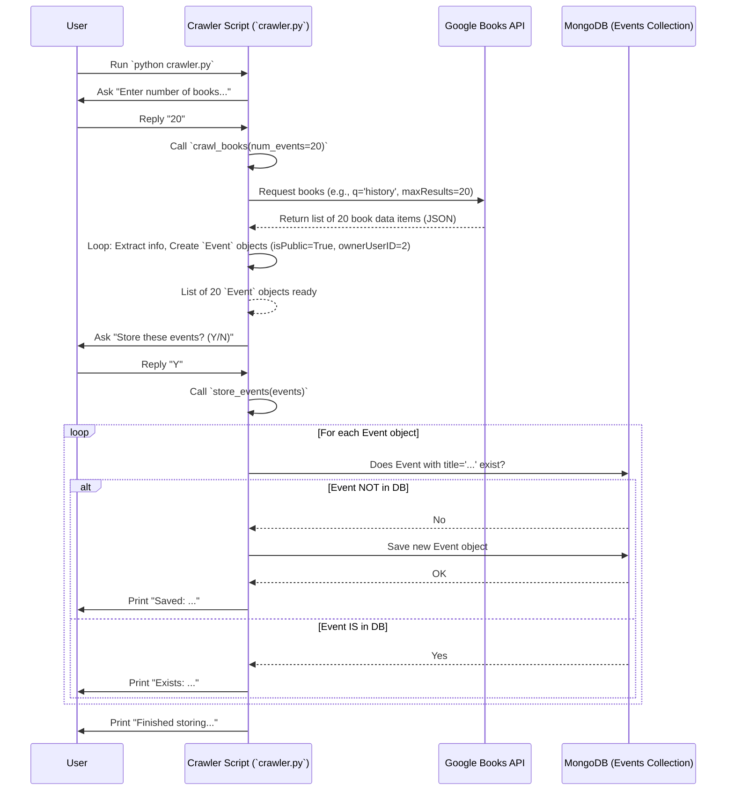

# Chapter 6: Data Ingestion (Web Crawler)

Welcome back! In the [previous chapter](05_event_management_views__django__.md), we explored the Django Views that act like librarians, handling user requests to add, view, update, and delete event "filing cards." So far, all the events in our `ResourceLearningWeb` library have been added *manually* by our users.

But what if our library could automatically discover new learning resources from the vast world outside? Imagine a librarian who automatically scans announcements for new workshops or finds relevant books from a giant online archive and adds them to our library shelves for everyone to see.

This chapter introduces our **Data Ingestion script**, often called a **Web Crawler** or **Scraper**. Its job is to automatically fetch information about learning resources (specifically, books from Google Books) and add them to our `ResourceLearningWeb` database as new, public `Event`s.

## The Problem: Keeping the Library Stocked Automatically

Manually adding every interesting online course, webinar, or book is a lot of work! If we want `ResourceLearningWeb` to be a rich resource, we need a way to automatically pull in relevant information from other places on the internet.

Our specific use case here is:
*   **Find new books:** Automatically search the Google Books library (a huge online collection) for books on various topics.
*   **Extract details:** Get information like the book's title, description, cover image, and categories.
*   **Format & Store:** Convert this information into the structure of our `Event` model ([Event Data Model (MongoEngine)](02_event_data_model__mongoengine__.md)) and save it in our database as a *public* event that anyone using our site can see.

## Key Concepts: How the Crawler Works

Let's break down the steps our automatic librarian (the crawler script) takes:

1.  **Target Source (Google Books API):** We need a place to get the data from. In this case, we're using the **Google Books API**. An API (Application Programming Interface) is like a special doorway that Google provides, allowing our script to request information from their massive book database in a structured way.
2.  **Making a Request:** Our script sends a message (an HTTP request) to the Google Books API's "doorway". This message asks for books matching certain criteria (e.g., "books about Python programming", "new history books").
3.  **Receiving the Response:** The Google Books API sends back a reply (an HTTP response), usually containing the requested book information formatted in a computer-readable language called JSON (JavaScript Object Notation). Think of it like getting a list of book details back from the librarian.
4.  **Parsing and Extracting:** Our script reads the JSON response and pulls out the specific pieces of information we care about: the title, description, image URL, and categories for each book.
5.  **Transforming Data:** The extracted information might not perfectly match our `Event` model's fields. For example, Google Books might have a long description, but our `Event` model has a length limit. Our script cleans up and adjusts the data (like trimming the description) to fit our `Event` template. It also crucially sets `isPublic = True` and assigns a default `ownerUserID` (representing the system or an admin account) since no specific user added this event.
6.  **Storing in Database:** Finally, the script takes the transformed data (now formatted as an `Event` object) and uses MongoEngine (our translator from [Chapter 2](02_event_data_model__mongoengine__.md)) to save it into our MongoDB database.

## How We Use the Crawler: Populating Public Events

The crawler script (`MLAlgo/webCrawler/crawler.py`) is designed to be run independently (not directly through the website). When run, it performs the steps above to add new book entries as public events.

**Code Reference (`MLAlgo/webCrawler/crawler.py` - Event Model):**
First, the crawler needs to know the structure of an `Event`, just like our main website. It uses the same MongoEngine definition.

```python
# MLAlgo/webCrawler/crawler.py
from mongoengine import Document, StringField, DateTimeField, URLField, IntField, BooleanField, ListField
from datetime import datetime, timezone

# This defines the structure for saving Events to MongoDB
class Event(Document):
    title = StringField(required=True, max_length=100) # Max 100 chars
    description = StringField(required=True, max_length=400) # Max 400 chars
    startTime = DateTimeField(required=True, default=datetime.utcnow)
    URL = URLField(blank=True, null=True)
    ownerUserID = IntField(required=True) # Which user owns this?
    isPublic = BooleanField(default=False) # Is it visible to everyone?
    tags = ListField(StringField(), default=[])
    image = StringField(blank=True, null=True) # Image link (optional)
    labels = ListField(StringField(), default=[]) # Categories from source

    def __str__(self):
        return self.title
```

*   This is the same `Event` model definition we saw in [Chapter 2](02_event_data_model__mongoengine__.md). It tells the crawler script how the event data should be structured before saving it to MongoDB. Note the `max_length` limits for `title` and `description`.

**Code Reference (`MLAlgo/webCrawler/crawler.py` - Fetching Books):**
This function handles asking Google Books for information.

```python
# MLAlgo/webCrawler/crawler.py
import requests
import random
from datetime import datetime, timezone

# Function to fetch random book events from Google Books API
def crawl_books(num_events=10, api_key="YOUR_GOOGLE_API_KEY"): # Use your actual key!
    url = f"https://www.googleapis.com/books/v1/volumes"
    # Choose a random topic to search for
    general_queries = ["programming", "science", "history", "python", "data science"]
    query = random.choice(general_queries)
    start_index = random.randint(1, 200) # Get different results each time

    params = { # These are the options we send to Google Books
        "q": query,
        "startIndex": start_index,
        "maxResults": num_events,
        "key": api_key,
        "country": 'US' # Optional: focus on books available in the US
    }

    # Send the request to Google Books API
    print(f"Requesting {num_events} books about '{query}'...")
    response = requests.get(url, params=params)

    if response.status_code != 200: # Check if the request was successful
        print(f"Failed: {response.status_code}, {response.text}")
        return [] # Return empty list on failure

    data = response.json() # Get the data as JSON
    events = [] # Prepare an empty list to store our formatted events

    # Loop through each book found by the API
    for item in data.get('items', []):
        try:
            # Extract information, respecting length limits
            title = item['volumeInfo'].get('title', 'No title')[:100]
            description = item['volumeInfo'].get('description', 'No description.')[:400]
            image_url = item['volumeInfo'].get('imageLinks', {}).get('thumbnail')
            event_url = item['volumeInfo'].get('infoLink')
            categories = item['volumeInfo'].get('categories', []) # Get categories

            # Create an Event object (our format)
            event = Event(
                title=title,
                description=description,
                startTime=datetime.now(timezone.utc), # Use current time as placeholder
                URL=event_url,
                ownerUserID=2, # Assign to a system user ID (e.g., 2)
                isPublic=True, # <<< IMPORTANT: Make it public!
                image=image_url[:200] if image_url else None, # Limit URL length
                labels=categories # Store the book categories as labels
            )
            events.append(event) # Add the formatted event to our list
        except Exception as e:
            print(f"Skipping book due to error: {e}")

    print(f"Successfully extracted {len(events)} events.")
    return events
```

*   **Input:** Number of events to fetch (`num_events`).
*   **Process:**
    *   Chooses a random search query.
    *   Builds the parameters for the Google Books API request.
    *   Uses the `requests` library to send the request.
    *   Checks if the request was successful (status code 200).
    *   Parses the JSON response.
    *   Loops through each book (`item`).
    *   Extracts `title`, `description`, `image_url`, `event_url`, and `categories`. It uses slicing `[:100]` and `[:400]` to ensure the data doesn't exceed the model's `max_length`.
    *   Creates an `Event` object using the extracted data. **Crucially, it sets `isPublic=True` and assigns a fixed `ownerUserID` (e.g., `2`)**, indicating this event wasn't added by a regular user but by the system. It stores the Google Books categories in the `labels` field.
*   **Output:** A list of `Event` objects ready to be saved.

**Code Reference (`MLAlgo/webCrawler/crawler.py` - Storing Events):**
This function takes the list of formatted `Event` objects and saves them to MongoDB.

```python
# MLAlgo/webCrawler/crawler.py
# (Requires MongoDB connection to be set up earlier using 'connect(...)')

# Function to store events in MongoDB
def store_events(events):
    saved_count = 0
    skipped_count = 0
    for event in events:
        try:
            # Check if an event with the EXACT same title already exists
            existing_event = Event.objects(title=event.title).first()
            if not existing_event:
                # If it doesn't exist, save the new event
                event.save() # Uses MongoEngine to save to MongoDB
                print(f"Saved: {event.title}")
                saved_count += 1
            else:
                # If it exists, skip saving this one
                print(f"Exists: {event.title}")
                skipped_count += 1
        except Exception as e:
            # Handle potential errors during saving
            print(f"Error saving '{event.title}': {e}")
            skipped_count += 1
    print(f"\nFinished storing. Saved: {saved_count}, Skipped/Errors: {skipped_count}")
```

*   **Input:** A list of `Event` objects generated by `crawl_books`.
*   **Process:**
    *   Loops through each `Event` object.
    *   Uses `Event.objects(title=event.title).first()` to query MongoDB (via MongoEngine) and see if an event with the same title is already there. This is a simple way to avoid duplicates.
    *   If no existing event is found (`not existing_event`), it calls `event.save()` to store the new event document in the MongoDB `event` collection.
    *   Prints progress messages.
*   **Output:** Events are saved to the database. Prints a summary of how many were saved or skipped.

**Code Reference (`MLAlgo/webCrawler/crawler.py` - Running the Crawler):**
The main part of the script connects the pieces.

```python
# MLAlgo/webCrawler/crawler.py
# (Requires MongoDB connection to be set up earlier using 'connect(...)')

# Main function to crawl and store
def crawl_and_store():
    # Ask how many books to fetch
    num_to_fetch_str = input("Enter number of books to fetch (e.g., 20): ")
    try:
        num_to_fetch = int(num_to_fetch_str)
    except ValueError:
        num_to_fetch = 10 # Default to 10 if input is invalid

    # 1. Fetch book events from Google Books API
    book_events = crawl_books(num_events=num_to_fetch)

    if not book_events:
        print("No events found or fetched.")
        return

    # (Optional: Print fetched events here for review)
    # print_events(book_events) # Assumes a print_events function exists

    # 2. Ask for confirmation before saving
    user_input = input("Do you want to store these events? (Y/N): ").strip().upper()

    if user_input == 'Y':
        # 3. Store the events in the database
        store_events(book_events)
    else:
        print("Events not stored.")

# This block ensures crawl_and_store() runs when the script is executed directly
if __name__ == "__main__":
    # (Code to establish MongoDB connection usually goes here)
    # try:
    #     connect(host=connection_uri) # From Chapter 2
    #     print("MongoDB connected successfully!")
    # except Exception as e:
    #     print(f"Error connecting to MongoDB: {e}")
    #     exit() # Stop if DB connection fails

    crawl_and_store()
```

*   This code orchestrates the process:
    *   Gets the number of books to fetch from the user.
    *   Calls `crawl_books` to get the list of `Event` objects.
    *   Asks the user if they want to save them.
    *   If yes, calls `store_events` to save them to MongoDB.

## Under the Hood: The Crawler's Journey

Let's visualize the process when the `crawl_and_store` function runs:



This diagram shows the flow: the script gets instructions, talks to the Google Books API, processes the results into `Event` objects, checks for duplicates in MongoDB, and saves the new ones.

## Conclusion

In this chapter, we learned about the **Data Ingestion (Web Crawler)** script, our automated librarian.

*   It automatically fetches data from an external source (Google Books API).
*   It extracts relevant information (title, description, image, categories).
*   It transforms this data into our `Event` model format ([Event Data Model (MongoEngine)](02_event_data_model__mongoengine__.md)), ensuring events are marked as `isPublic=True` and assigned a system `ownerUserID`.
*   It stores these new, public events in our MongoDB database, enriching the content available in `ResourceLearningWeb` without manual user input.
*   It includes a simple check to avoid adding duplicate events based on the title.

Now that we have a way to get potentially many events into our system (both manually added and automatically crawled), how can we make sense of them? Many events might not have useful tags. Could we automatically figure out relevant keywords or tags for each event based on its title and description? That's where machine learning comes in!

Next up: [Automatic Event Tagging (ML)](07_automatic_event_tagging__ml__.md)

---

Generated by [AI Codebase Knowledge Builder](https://github.com/The-Pocket/Tutorial-Codebase-Knowledge)