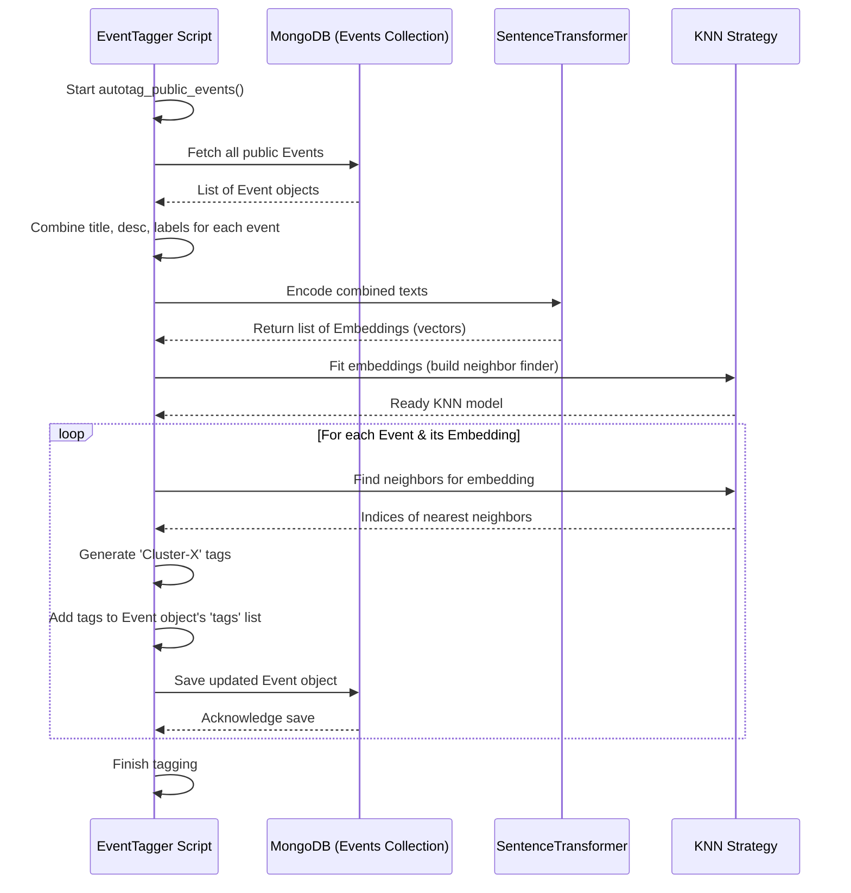

# Chapter 7: Automatic Event Tagging (ML)

Welcome back! In the [previous chapter](06_data_ingestion__web_crawler__.md), we learned how our `ResourceLearningWeb` project can automatically pull in new learning resources, like books from Google Books, using a web crawler. This is great for keeping our library stocked!

But there's a small problem. These automatically added events, and even some manually added ones, might not have very descriptive keywords or "tags" associated with them. A book about "Astrophysics" might just have the label "Science" from the crawler. How can users easily find events related to "space", "stars", or "planets" if those keywords aren't there? Manually tagging thousands of events would be impossible!

This chapter introduces a smart solution: **Automatic Event Tagging using Machine Learning (ML)**. Think of it as hiring an incredibly fast assistant librarian who can read every public event card and automatically add helpful keyword tags based on its content and how similar it is to other cards.

## The Problem: Missing Keywords and How to Find Them

Imagine our library has hundreds of event cards added by the crawler.
*   Card 1: "Introduction to Python Programming" (Label: Programming)
*   Card 2: "Advanced Python Techniques" (Label: Programming)
*   Card 3: "Learning Java Basics" (Label: Programming)
*   Card 4: "History of Ancient Rome" (Label: History)
*   Card 5: "The Roman Empire" (Label: History)

We want to automatically add tags. We can see that Card 1 and Card 2 are very similar (both about Python), and Card 4 and Card 5 are similar (both about Roman history). Card 3 is about programming, but less similar to the Python ones.

How can a computer figure this out automatically and add useful tags like "Python", "Java", or "Roman History"? This is where Machine Learning comes in.

## Key Concepts: Teaching the Computer to Group Events

Machine Learning lets computers learn patterns from data without being explicitly programmed for every single task. For auto-tagging, we use a few key ideas:

1.  **Understanding Text (Embeddings):** Computers don't understand words like "Python" or "History" directly. We need to convert the text information of each event (like its title, description, and existing labels) into a list of numbers. This list of numbers is called an **embedding** or a **vector**. The cool part is that ML models are designed so that events with *similar meanings* will have *similar lists of numbers*.
    *   *Analogy:* Imagine plotting each event on a giant map based on its meaning. Events about Python would cluster together in one area, while events about Roman history would cluster in another. The "embedding" is like the coordinates (latitude/longitude) of the event on this meaning-map.

2.  **Finding Similar Events (Clustering):** Once we have these numerical coordinates (embeddings) for all public events, we can use an algorithm to find groups or "clusters" of events that are close together on our meaning-map. Events in the same cluster are likely about similar topics. We use a specific technique related to finding the *nearest neighbors* for each event – which other events are closest to it on the map?
    *   *Analogy:* Looking at the map, the algorithm draws circles around the groups of points that are close together. The Python events are in one circle, the Roman history events in another.

3.  **Assigning Tags:** Now that we have these groups (clusters), we can automatically assign a tag based on the group. For simplicity, we might just label the groups numerically (e.g., "Cluster-1", "Cluster-2"). If an event belongs to the "Python" cluster (say, Cluster-5), we add the tag "Cluster-5" to its list of tags. If another event belongs to the "Roman History" cluster (say, Cluster-8), we add "Cluster-8" to its tags.
    *   *Analogy:* We put a sticker on every event card inside the "Python" circle that says "Python Group", and a sticker on every card in the "Roman History" circle that says "History Group".

## How We Use ML to Tag Events: The `EventTagger`

Our project uses a component called `EventTagger` (found in `MLAlgo/EventTagger.py`) to perform these steps. It works like this:

1.  **Fetch Public Events:** It gets all the events marked as `isPublic=True` from our MongoDB database (using the [Event Data Model (MongoEngine)](02_event_data_model__mongoengine__.md)).
2.  **Prepare Text:** For each event, it combines the important text fields: `title`, `description`, and any existing `labels` (like those from the crawler).
3.  **Generate Embeddings:** It uses a pre-trained ML model (specifically, `SentenceTransformer('paraphrase-MiniLM-L6-v2')`) to convert the combined text of each event into a numerical embedding (a list of numbers representing its meaning).
4.  **Cluster/Find Neighbors:** It uses a clustering strategy (like K-Nearest Neighbors, or KNN, implemented in `MLAlgo/ClusteringStrategy.py`) to find the closest neighbors for each event based on their embeddings.
5.  **Assign Cluster Tags:** Based on the neighbors found, it generates cluster-based tags (like "Cluster-1", "Cluster-5"). It adds these tags to the `tags` list field of the `Event` object.
6.  **Save Changes:** It saves the updated `Event` objects (now with new tags) back into the MongoDB database.

Let's look at some simplified code snippets from `MLAlgo/EventTagger.py`.

**1. Setting up the Tagger:**
The `EventTagger` needs to know which clustering method to use.

```python
# MLAlgo/EventTagger.py
from sentence_transformers import SentenceTransformer
import ClusteringStrategy # Our file defining clustering methods
from webCrawler.crawler import Event # Uses the Event model definition
import numpy as np

class EventTagger:
    def __init__(self, clustering_strategy: ClusteringStrategy):
        # Load the pre-trained ML model to convert text to numbers
        self.model = SentenceTransformer('paraphrase-MiniLM-L6-v2')
        # Store the chosen clustering method (e.g., KNN)
        self.clustering_strategy = clustering_strategy
```

*   **Explanation:** When we create an `EventTagger`, we give it a `clustering_strategy` (like KNN). It also loads the `SentenceTransformer` model, which is ready to turn text into embeddings.

**2. The Auto-Tagging Process (`autotag_public_events` simplified):**

```python
# MLAlgo/EventTagger.py (inside EventTagger class)
    def autotag_public_events(self):
        # 1. Fetch all public events from MongoDB
        events = Event.objects(isPublic=True)
        if not events:
            print("No public events to tag.")
            return

        # 2. Create combined text for each event
        event_texts = [
            f"{event.title}: {event.description}. Label: {', '.join(event.labels)}"
            for event in events
        ]

        # 3. Generate numerical embeddings using the ML model
        print("Generating embeddings...")
        embeddings = self.model.encode(event_texts)

        # 4. Use the clustering strategy to find groups/neighbors
        print("Finding neighbors...")
        knn_model = self.clustering_strategy.fit(embeddings)

        # 5. Assign tags based on neighbors
        print("Assigning tags...")
        for i, event in enumerate(events):
            # Find the indices of the nearest neighbors for this event
            neighbors_indices = knn_model.kneighbors(
                embeddings[i].reshape(1, -1), # Reshape needed for the function
                return_distance=False
            )
            # Create tags like "Cluster-0", "Cluster-5", etc. based on neighbors
            neighbor_tags = [f"Cluster-{j}" for j in neighbors_indices[0]]

            # 6. Add new tags to the event's tag list (avoid duplicates)
            for tag in neighbor_tags:
                if tag not in event.tags:
                    event.tags.append(tag)

            # 7. Save the updated event back to MongoDB
            event.save()
            print(f"Tagged: '{event.title}' with {', '.join(neighbor_tags)}")

        print("Auto-tagging complete.")
```

*   **Input:** A collection of public `Event` documents in MongoDB.
*   **Process:**
    *   Fetches events.
    *   Combines `title`, `description`, and `labels` into `event_texts`.
    *   Calls `self.model.encode()` to get `embeddings`.
    *   Calls the `clustering_strategy.fit()` method which prepares the KNN model.
    *   Loops through each event:
        *   Calls `knn_model.kneighbors()` to find the indices of similar events.
        *   Creates simple `Cluster-X` tags based on these neighbors.
        *   Appends these tags to the `event.tags` list (which is part of the [Event Data Model (MongoEngine)](02_event_data_model__mongoengine__.md)).
        *   Saves the event back to MongoDB using `event.save()`.
*   **Output:** The public `Event` documents in MongoDB are updated with new cluster-based tags in their `tags` field. The script prints which tags were added to each event title.

## Under the Hood: How the Tagger Works

Let's trace the steps when the `autotag_public_events` method is called:

1.  **Fetch Data:** The `EventTagger` asks MongoDB for all `Event` documents where `isPublic` is `True`.
2.  **Prepare Text:** It creates a single string for each event containing its title, description, and labels.
3.  **Embed Text:** It feeds these strings to the `SentenceTransformer` model. The model outputs a list of numbers (an embedding vector) for each event. Similar events get similar vectors.
4.  **Build Neighbor Finder:** It passes all these embedding vectors to the `KNNStrategy`. The strategy uses a library (`scikit-learn`) to build an efficient way to quickly find the nearest numerical vectors (neighbors) for any given vector.
5.  **Find Neighbors & Tag:** For each event's embedding vector:
    *   It asks the KNN model: "Which other vectors are closest to this one?"
    *   The model returns the indices of the nearest neighbors.
    *   The `EventTagger` creates tags like "Cluster-0", "Cluster-5" based on these indices.
    *   It adds these tags to the `tags` list of the original `Event` object.
6.  **Save:** It tells MongoEngine to save the modified `Event` object back to the database, overwriting the old version with the newly tagged one.

Here's a diagram showing the flow:



### Diving Deeper into the Code

*   **The Embedding Model (`EventTagger.py`):**
    ```python
    # MLAlgo/EventTagger.py
    # This specific model is chosen because it's good at understanding
    # sentence meaning and is relatively small and fast.
    self.model = SentenceTransformer('paraphrase-MiniLM-L6-v2')
    ```
    This line loads a model that someone else has already trained on a huge amount of text. We can just use it directly to get meaningful embeddings.

*   **The Clustering Strategy (`ClusteringStrategy.py`):**
    ```python
    # MLAlgo/ClusteringStrategy.py
    from sklearn.neighbors import NearestNeighbors # Using a standard ML library

    class KNNStrategy(ClusteringStrategy):
        def __init__(self, n_neighbors=5):
            self.n_neighbors = n_neighbors # How many neighbors to find

        def fit(self, embeddings):
            # Use 'cosine' distance for text embeddings
            knn = NearestNeighbors(n_neighbors=self.n_neighbors, metric='cosine')
            # 'fit' prepares the model to quickly find neighbors later
            knn.fit(embeddings)
            return knn # Return the ready-to-use model
    ```
    This defines how we find neighbors. It uses the `NearestNeighbors` tool from the popular `scikit-learn` library. The `fit` method doesn't do complex training here; it mainly organizes the embedding data so that finding neighbors later using `kneighbors` (seen in `EventTagger`) is fast. We use `'cosine'` distance because it works well for comparing the directions of embedding vectors, which relates to semantic similarity.

*   **Using Labels (`EventTagger.py`):**
    ```python
    # MLAlgo/EventTagger.py
    # We include labels from the crawler in the text to give the
    # embedding model more context about the event's category.
    event_texts = [
        f"{event.title}: {event.description}. Label: {', '.join(event.labels)}"
        for event in events
    ]
    ```
    By adding the `labels` (like "Science", "Programming") gathered by the [Data Ingestion (Web Crawler)](06_data_ingestion__web_crawler__.md) to the text before embedding, we give the ML model a bit more information to help it create more accurate numerical representations.

## Conclusion

In this chapter, we learned about the magic of **Automatic Event Tagging using Machine Learning**.

*   We saw that ML can help solve the problem of missing keywords or tags, especially for events added automatically.
*   The core idea is to convert event text (`title`, `description`, `labels`) into numerical **embeddings**.
*   We then use **clustering** (specifically, finding nearest neighbors) to group events with similar embeddings.
*   Finally, we assign **cluster-based tags** (like "Cluster-5") to the events in each group, storing them in the `tags` field of our [Event Data Model (MongoEngine)](02_event_data_model__mongoengine__.md).
*   Our `EventTagger` script orchestrates this process using a pre-trained `SentenceTransformer` model and a `KNNStrategy`.

These automatically generated tags, while simple ("Cluster-X"), provide a powerful way to understand the relationships between events based on their content. They act as foundational keywords.

Now that our events have these useful (even if automatically generated) tags, how can we use them to suggest *other* relevant events to a user? If a user has shown interest in events tagged "Cluster-5", maybe they'd like other public events also tagged "Cluster-5"? That's exactly what we'll explore next!

Next up: [Event Recommendation Logic](08_event_recommendation_logic_.md)

---

Generated by [AI Codebase Knowledge Builder](https://github.com/The-Pocket/Tutorial-Codebase-Knowledge)