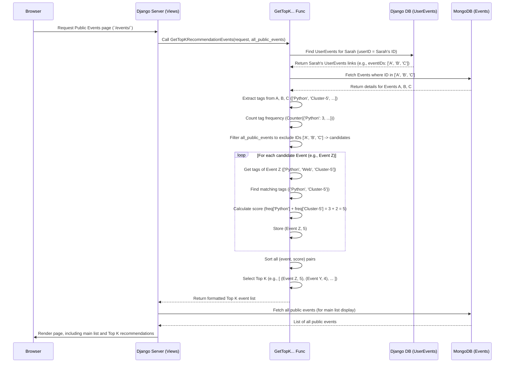

# Chapter 8: Event Recommendation Logic

Welcome to the final chapter of the core `ResourceLearningWeb` tutorial! In [Chapter 7: Automatic Event Tagging (ML)](07_automatic_event_tagging__ml__.md), we saw how our system can automatically add keyword tags (like "Cluster-5" or "Cluster-8") to public events based on their content. This helps organize our growing library of resources.

But just having tags isn't enough. How can we use these tags to proactively help users discover new events they might like? Imagine our friendly librarian again. They notice you often borrow books (opt-in to events) about 'space travel' and 'robots' (tags). Wouldn't it be helpful if they could point you towards *other* books on the public shelves that also have those keywords, especially the ones you haven't seen yet?

This chapter explores the **Event Recommendation Logic** – how `ResourceLearningWeb` suggests relevant public events to logged-in users.

## The Problem: Discovering Relevant New Events

Let's say a user, Sarah, has been using `ResourceLearningWeb`. She has opted-in to several events:
*   "Introduction to Python Programming" (Tags: Programming, Python, Cluster-5)
*   "Data Analysis with Pandas" (Tags: Data Science, Python, Cluster-5)
*   "Machine Learning Basics" (Tags: ML, Python, Data Science, Cluster-9)

There are many other public events on the site, like:
*   "Advanced Python Workshop" (Tags: Python, Advanced, Cluster-5) - *Sarah hasn't opted into this yet.*
*   "Web Scraping with Python" (Tags: Python, Web, Cluster-5) - *Sarah hasn't opted into this yet.*
*   "History of Computing" (Tags: History, Computing, Cluster-12) - *Sarah hasn't opted into this yet.*

How can the system intelligently recommend the "Advanced Python Workshop" and "Web Scraping with Python" to Sarah, but probably not the "History of Computing" event? It needs a logic based on her past interests.

## Key Concepts: Recommending Based on Tags

Our recommendation system works by comparing the tags of events Sarah *likes* with the tags of public events she *hasn't* opted into yet. Here's the breakdown:

1.  **Identify User's Interests (Tags):** First, we look at all the events Sarah has explicitly opted into using the [Public Events & Opt-In System](03_public_events___opt_in_system_.md). We collect all the `tags` associated with these events (including the automatic "Cluster-X" tags from [Chapter 7](07_automatic_event_tagging__ml__.md)). In Sarah's case, her interest tags are: `Programming`, `Python`, `Cluster-5`, `Data Science`, `ML`, `Cluster-9`.

2.  **Prioritize Frequent Tags:** We count how often each tag appears in Sarah's collection. Tags that appear more frequently are likely stronger indicators of her interests.
    *   `Python`: Appears 3 times.
    *   `Cluster-5`: Appears 2 times.
    *   `Data Science`: Appears 2 times.
    *   `Programming`, `ML`, `Cluster-9`: Appear 1 time each.
    This tells us `Python`, `Cluster-5`, and `Data Science` are currently her strongest interests based on her opt-ins.

3.  **Find Candidate Events:** We find all the public `Event`s ([Event Data Model (MongoEngine)](02_event_data_model__mongoengine__.md)) that Sarah has *not* yet opted into. These are the potential recommendations.

4.  **Match Tags & Score:** For each candidate event, we check if its tags overlap with Sarah's interest tags. We give each candidate event a "recommendation score". The score is higher if:
    *   It shares more tags with Sarah's interests.
    *   The shared tags are ones that appear *frequently* in Sarah's opted-in events (like `Python` or `Cluster-5`).

5.  **Rank and Recommend:** We sort the candidate events by their score, from highest to lowest. We then suggest the top few (e.g., the top 5) highest-scoring events to Sarah.

## How It Works: The `GetTopKRecommendationEvents` Function

This logic is implemented primarily within a helper function in our Django views, called `GetTopKRecommendationEvents`. This function is used by the `list_publicEvents` view ([Chapter 5: Event Management Views (Django)](05_event_management_views__django__.md)) to generate recommendations displayed on the public events page.

Let's break down the steps inside this function, referring to `event/views.py`.

**Step 1: Get User's Opted-In Events and Tags**

First, we need to know which events the user cares about and what their tags are.

**Code Reference (`event/views.py` - Simplified Snippet 1):**

```python
# event/views.py (Inside GetTopKRecommendationEvents)
from .models import UserEvents, Event # Need both models
from mongoengine.queryset.visitor import Q # For complex queries
from collections import Counter # To count tag frequency

# Check if user is logged in
if not request.user.is_authenticated:
    return [] # No recommendations for anonymous users

# 1a. Find the UserEvents links for the logged-in user (from Django DB)
user_event_links = UserEvents.objects.filter(userID=request.user)
if not user_event_links.exists():
    return [] # No opt-ins, so no recommendations

# 1b. Get the IDs of the events the user opted into
opted_in_event_ids = [link.eventID for link in user_event_links]

# 1c. Fetch the details of those events from MongoDB
opted_in_events = Event.objects.filter(id__in=opted_in_event_ids)

# 1d. Collect all tags from these events into a single list
user_tags = []
for event in opted_in_events:
    user_tags.extend(event.tags) # event.tags is a list of strings
```

*   **Input:** The `request` object, containing the logged-in user.
*   **Process:** Uses the [User-Event Relationship](04_user_event_relationship_.md) bridge (`UserEvents`) to find the IDs of events the user opted into, fetches those `Event` details from MongoDB, and gathers all their associated `tags` into the `user_tags` list.
*   **Output:** A list `user_tags` containing all tags from the user's opted-in events (e.g., `['Programming', 'Python', 'Cluster-5', 'Data Science', 'Python', 'Cluster-5', ...]` ).

**Step 2: Count Tag Frequency**

Now we count how often each tag appeared.

**Code Reference (`event/views.py` - Simplified Snippet 2):**

```python
# event/views.py (Inside GetTopKRecommendationEvents, continued)

# 2. Count how many times each tag appears in the user's list
#    Counter({'Python': 3, 'Cluster-5': 2, 'Data Science': 2, ...})
tag_counter = Counter(user_tags)
```

*   **Input:** The `user_tags` list from Step 1.
*   **Process:** Uses Python's `collections.Counter` tool (think of it like an automatic tally counter) to count the occurrences of each tag.
*   **Output:** A `tag_counter` object that stores the frequency of each tag.

**Step 3: Get Candidate Public Events**

We need to find events to potentially recommend: public events the user *hasn't* already opted into.

**Code Reference (`event/views.py` - Simplified Snippet 3):**

```python
# event/views.py (Inside GetTopKRecommendationEvents, continued)

# 3. Fetch public events that the user has NOT opted into.
#    'publicEvents' is the base queryset of all public events passed into the function.
#    Q(id__nin=...) means "where the id is NOT IN the list"
candidate_events = publicEvents.filter(Q(id__nin=opted_in_event_ids))
```

*   **Input:** The list of `opted_in_event_ids` from Step 1 and a query (`publicEvents`) representing all public events.
*   **Process:** Filters the list of all public events to exclude those the user has already opted into. The `Q(id__nin=...)` is a MongoEngine query part that means "select events where the `id` field is *not in* the provided list".
*   **Output:** A collection (`candidate_events`) of `Event` objects that are public and not yet opted into by the user.

**Step 4: Score and Rank Candidates**

This is the core logic: calculate a score for each candidate based on shared tags and the user's tag frequencies.

**Code Reference (`event/views.py` - Simplified Snippet 4):**

```python
# event/views.py (Inside GetTopKRecommendationEvents, continued)

# 4. Rank the candidate events based on matching tags
event_rankings = []
for event in candidate_events:
    # Find which tags this candidate event shares with the user's interests
    matching_tags = set(event.tags).intersection(tag_counter.keys())

    # Calculate score: sum the frequency counts of the matching tags
    # Example: If matches 'Python' (freq 3) and 'Cluster-5' (freq 2), score = 3 + 2 = 5
    rank_score = sum(tag_counter[tag] for tag in matching_tags)

    # Store the event and its calculated score
    if rank_score > 0: # Only consider events with some match
        event_rankings.append((event, rank_score))

# Sort the list of (event, score) pairs by score, highest first
event_rankings.sort(key=lambda item: item[1], reverse=True)
```

*   **Input:** The `candidate_events` list and the `tag_counter` frequency map.
*   **Process:**
    *   Loops through each `candidate_event`.
    *   Finds the `matching_tags` between the candidate's tags and the user's tags.
    *   Calculates a `rank_score` by adding up the frequencies (from `tag_counter`) of the `matching_tags`. Events matching more frequent user tags get higher scores.
    *   Stores pairs of `(event, rank_score)`.
    *   Sorts these pairs in descending order based on the `rank_score`.
*   **Output:** A sorted list `event_rankings` where events most relevant to the user (based on tag overlap and frequency) appear first.

**Step 5: Return Top K Recommendations**

Finally, select the top few recommendations from the sorted list.

**Code Reference (`event/views.py` - Simplified Snippet 5):**

```python
# event/views.py (Inside GetTopKRecommendationEvents, continued)

# 5. Get the top K recommended event objects (K is often 3 or 5)
K = 5 # Example: Show top 5 recommendations
top_k_events = [event for event, score in event_rankings[:K]]

# (Code here formats 'top_k_events' into a list of dictionaries for the template)
# ... formatting logic ...

return formatted_top_k_events # Return the final list
```

*   **Input:** The sorted `event_rankings` list.
*   **Process:** Takes the first `K` items from the sorted list (these are the highest-scoring events) and extracts just the `Event` objects. It then formats these into a structure suitable for displaying in the HTML template.
*   **Output:** A list containing the details of the top K recommended events.

## Under the Hood: Sarah Gets Recommendations

Let's visualize the process when Sarah visits the public events page:



This shows how the view calls the recommendation function, which talks to both databases, performs calculations based on tag frequency and overlap, and returns a ranked list used to enhance the page displayed to Sarah.

## Conclusion

In this final chapter, we explored the **Event Recommendation Logic** in `ResourceLearningWeb`. We learned how the system suggests relevant public events to users:

*   It analyzes the **tags** of events a user has **opted into**.
*   It prioritizes tags that appear **frequently** in the user's history.
*   It finds **public events** the user **hasn't opted into** yet.
*   It **scores** these candidate events based on **overlapping tags**, giving more weight to matches with the user's frequent tags.
*   It **ranks** the candidates and presents the **top K** recommendations.

This system leverages the tags (both manual and automatically generated by the [Automatic Event Tagging (ML)](07_automatic_event_tagging__ml__.md)) to provide personalized discovery, making the `ResourceLearningWeb` platform more engaging and useful for its users.

This completes the core tutorial for the `ResourceLearningWeb` project! We've journeyed from setting up [User Authentication (Django)](01_user_authentication__django__.md), defining the [Event Data Model (MongoEngine)](02_event_data_model__mongoengine__.md), implementing the [Public Events & Opt-In System](03_public_events___opt_in_system_.md), managing the [User-Event Relationship](04_user_event_relationship_.md) and [Event Management Views (Django)](05_event_management_views__django__.md), automating [Data Ingestion (Web Crawler)](06_data_ingestion__web_crawler__.md), applying [Automatic Event Tagging (ML)](07_automatic_event_tagging__ml__.md), and finally, creating the [Event Recommendation Logic](08_event_recommendation_logic_.md).

We hope this step-by-step guide has given you a clear understanding of how these different components work together to build a functional web application with data processing and machine learning features. Happy coding!

---

Generated by [AI Codebase Knowledge Builder](https://github.com/The-Pocket/Tutorial-Codebase-Knowledge)