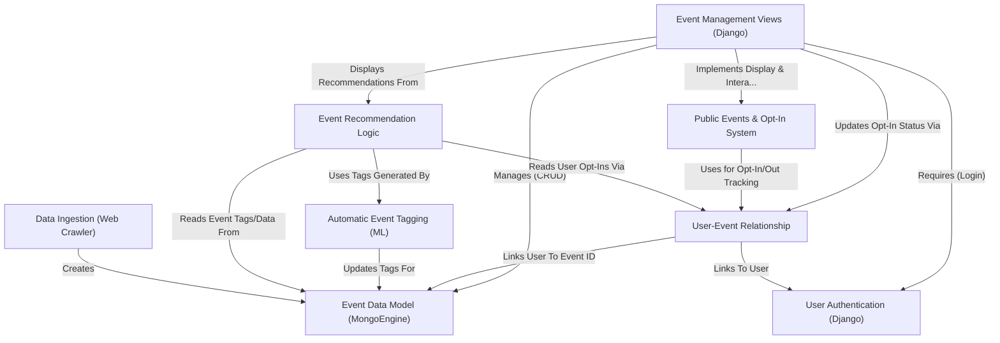

# Tutorial: ResourceLearningWeb

*ResourceLearningWeb* is a web application where users can manage and discover **learning resources**, referred to as *Events*.
Users can add their own private resources, browse **public Events** (some automatically imported, e.g., from Google Books), and *opt-in* to track public Events they like.
The system uses **Machine Learning** to automatically *tag* public Events for easier categorization and provides **recommendations** based on a user's opted-in Events.
Standard **user accounts** (login, registration) control access to features.

**Source Repository:** [https://github.com/daniel13520cs/ResourceLearningWeb](https://github.com/daniel13520cs/ResourceLearningWeb)

## Chapters

1. [User Authentication (Django)
](01_user_authentication__django__.md)
2. [Event Data Model (MongoEngine)
](02_event_data_model__mongoengine__.md)
3. [Public Events & Opt-In System
](03_public_events___opt_in_system_.md)
4. [User-Event Relationship
](04_user_event_relationship_.md)
5. [Event Management Views (Django)
](05_event_management_views__django__.md)
6. [Data Ingestion (Web Crawler)
](06_data_ingestion__web_crawler__.md)
7. [Automatic Event Tagging (ML)
](07_automatic_event_tagging__ml__.md)
8. [Event Recommendation Logic
](08_event_recommendation_logic_.md)

---

Generated by [AI Codebase Knowledge Builder](https://github.com/The-Pocket/Tutorial-Codebase-Knowledge)